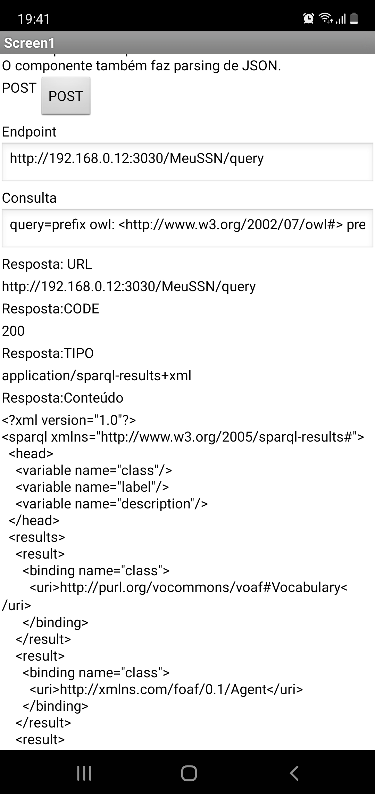
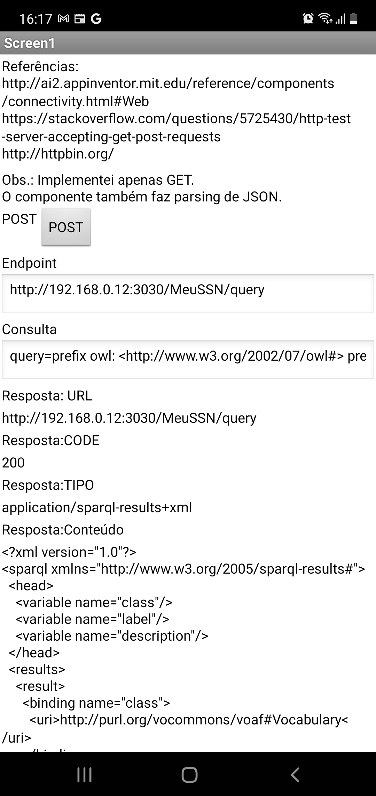
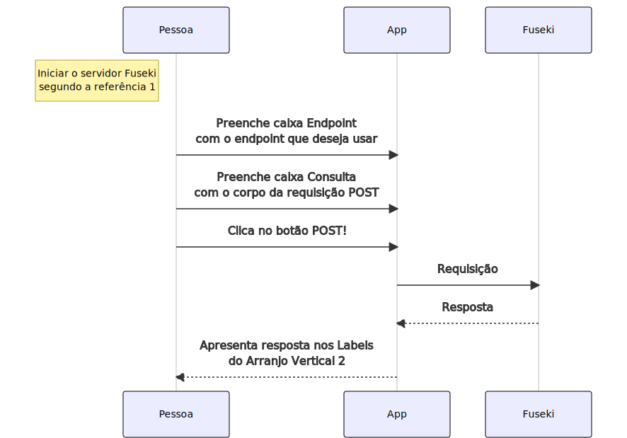
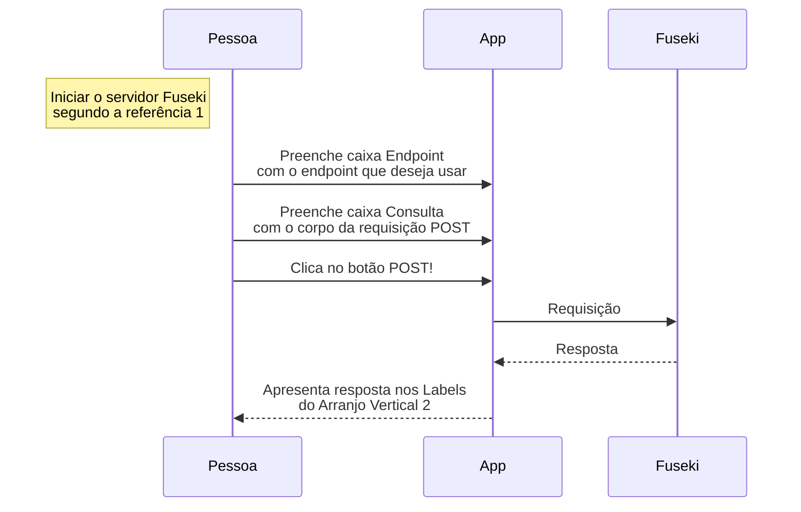

# App no App Inventor para fazer consulta em servidor Fuseki.

## Objetivo

Verificar se é possível, e quanto trabalho é necessário para criar um App de Android para fazer uma consulta em um servidor Fuseki.

## Descrição

Criar um App, instalar, executar em um telefone celular.

O App é criado usando App Inventor (ver Materiais, ítem 2). Neste, o componente `web` possibilita fazer requisições HTTP:POST a uma URL.

A URL é de um computador na rede local que está com Fuseki instalado e rodando (ver materiais ítem 3). Na barra de navegação está em http://localhost:3030. Usando `ifconfig`, ou outro comando que conhecer, localizar o IP do computador na rede local.

O conteúdo da requisição é uma adaptação do usado em Materiais, ítem 3. A adaptação faz apontar para outro *dataset*, nominalmente, `MeuSSN` ao invés de `mydataset`.

## Materiais e Referências

1. [Servidor Fuseki sendo executado no computador](https://github.com/santanajods/domotic-swot#rodando-fuseki-server)
2. [App Inventor](https://github.com/camilabezerril/ImageCV#apresenta%C3%A7%C3%A3o-contexto)
3. [Consultar servidor Fuseki usando curl](AlgunsExemplosDeUsoDeFuseki.md#fazer-uma-consulta-sparql-select-usando-curl-e-post) 

## Resultados

O app permite digitar a URL e a consulta. Os valores padrão são os que testei. Estão sintaticamente corretos. Na foto, já cliquei no botão POST! e o resultado já está na caixa de texto na parte de baixo da tela.



<!--  -->

Testei algumas vezes até chegar à consulta sintaticamente correta. No lado do servidor, na foto, no terminal, é possível ver que não houve erros pois a mensagem foi 200-SUCCESS.


### Conexão com a referência 3.

**nota**: esta é uma melhoria, considerando a necessidade de melhoria da documentação em geral.

A requisição na referência 3 é: `curl -X POST -d "query=select ?s where { ?s ?p ?o . }" localhost:3030/mydataset/query`. Nela, `localhost:3030/mydataset/query` é o endpoint, `"query=select ?s where { ?s ?p ?o . }" é o corpo da requisição POST. Comando e argumentos são `curl -X POST -d`. 

### Diagrama de sequência do exemplo do resultado

**nota**: esta é uma melhoria, considerando a necessidade de melhoria da documentação em geral. Para recuperar os dados, ajudou ter salvo o projeto do App Inventor.

Da consulta padrão (codificada no código-fonte do App, veja o `.aia`), o endpoint é `http://192.168.0.12:3030/MeuSSN/query`

O que no App chamei de consulta, para ser preciso, é o corpo da requisição POST, e é mais fácil de ler se estiver em multilinhas:

```
query=
  prefix owl: <http://www.w3.org/2002/07/owl#> 
  prefix rdfs: <http://www.w3.org/2000/01/rdf-schema#>
  SELECT DISTINCT ?class ?label ?description WHERE {
     ?class a owl:Class.
     OPTIONAL { ?class rdfs:label ?label}
     OPTIONAL { ?class rdfs:comment ?description} 
  }
  LIMIT 25
```

Um diagrama de sequência compatível com a execução do sistema é:



Código-fonte do diagrama (se seu navegador tiver algum plugin para renderizar mermaid, talvez você veja a imagem. Neste caso, clique na figura).




<!--  -->

[Arquivo .aia para ser importado no App Inventor e editado por você](Arquivos-AppInventor/Fuseki_Post.aia).

## Próximos passos

Acredito que seja possível, ajustando o endpoint para `update` e a consulta para `INSERT DATA`, inserir dados na base de conhecimento. Gostaria que alguém fizesse e documentasse os passos.

Com este resultado, é possível usar o celular como sensor, ou usar o celular para simular outros sensores, por exemplo, botões distribuídos em um local, fazer o envio dos dados dos sensores, preferencialmente em conformidade com SSN/SOSA (detalhes [aqui](SSNeSOSA-Dados.md)), e, do lado do servidor, representar mapas, criar raciocinadores, que, por exemplo, calcular rotas, ...

