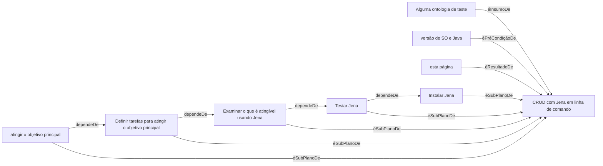

# Avaliar Jena como ferramenta para implementar ferramentas de gestão de conhecimento

## Motivação

## Métodos

SWOT: Strength, Weakness, Opportunities, Threats <https://pt.wikipedia.org/wiki/An%C3%A1lise_SWOT>;
SMART: Specific, Measurable, Attainable, Relevant, Time-bound <https://thoughtfullearning.com/inquireHSbook/pg356>;
WBS: Work Breakdown Structure <https://artia.com/blog/wbs-entenda-como-e-por-que-utilizar-uma-estrutura-analitica-de-projeto/>

- Escolha das ferramentas consideradas necessárias para gestão de conhecimento;
    - Revisão de bibliografia;
    - brainstorm;
    - avaliação de dificuldade (SWOT das ferramentas em avaliação);
        - elaboração de planos de trabalho de "baixa resolução";

- Construir, usando Jena, ferramentas escolhidas;
    - elaboração de planos de trabalho de "alta resolução";
        - SMART;
        - WBS;
        - usar PROV "manualmente" para criar um caso de teste;
        - usar PlansLite "manualmente" para criar um caso de teste.
    - Anotar os processos de construção: (SWOT do uso de Jena); 

## Resultados esperados

- ampliar conhecimento sobre web semântica;
- ampliar conhecimento sobre Jena;
- ter operando ferramentas de gestão de conhecimento

## Pré-avaliação: análise exploratória de Jena.

A natureza do objetivo principal deixa claro que atividades como:

1. instalar Jena;
2. fazer operações de dicionário;
    1. há mais de uma forma para fazer?

São necessárias, independente do detalhamento do plano para atingir o objetivo principal.


### 1 Instalar Jena

#### Pré-condições:

*Sistema Operacional*

<pre><font color="#859900"><b>fabio@fabio-13Z940-G-BK71P1</b></font>:<font color="#268BD2"><b>~/Documentos/ZZfiles/sobreJena/programas/Tutorial1</b></font>$ cat /etc/os-release 
NAME=&quot;Ubuntu&quot;
VERSION=&quot;20.04.1 LTS (Focal Fossa)&quot;
ID=ubuntu
ID_LIKE=debian
PRETTY_NAME=&quot;Ubuntu 20.04.1 LTS&quot;
VERSION_ID=&quot;20.04&quot;
HOME_URL=&quot;https://www.ubuntu.com/&quot;
SUPPORT_URL=&quot;https://help.ubuntu.com/&quot;
BUG_REPORT_URL=&quot;https://bugs.launchpad.net/ubuntu/&quot;
PRIVACY_POLICY_URL=&quot;https://www.ubuntu.com/legal/terms-and-policies/privacy-policy&quot;
VERSION_CODENAME=focal
UBUNTU_CODENAME=focal
</pre>

*JDK*

<pre><font color="#859900"><b>fabio@fabio-13Z940-G-BK71P1</b></font>:<font color="#268BD2"><b>~/Documentos/ZZfiles/sobreJena/programas/Tutorial1</b></font>$ javac --version
javac 11.0.9.1
</pre>

**nota:** é open-jdk, ou default-jdk. Com certeza não é o JDK da Oracle.

#### Instruções para instalação

1. Baixa de <https://jena.apache.org/download/index.cgi>, 
2. ajusta a variável de ambiente em `.profile` e 
3. chama `sparql --version`, conforme <https://jena.apache.org/documentation/tools/>

*PATH* (depois de ajustar a variável de ambiente, conforme <https://jena.apache.org/documentation/tools/>)

<pre><font color="#859900"><b>fabio@fabio-13Z940-G-BK71P1</b></font>:<font color="#268BD2"><b>~</b></font>$ echo $PATH
/home/fabio/.local/bin:/usr/local/sbin:/usr/local/bin:/usr/sbin:/usr/bin:/sbin:/bin:/usr/games:/usr/local/games:/snap/bin:/home/fabio/apache-jena-3.17.0/bin
<font color="#859900"><b>fabio@fabio-13Z940-G-BK71P1</b></font>:<font color="#268BD2"><b>~</b></font>$ 
</pre>

*Checando se executa algo*
<pre><font color="#859900"><b>fabio@fabio-13Z940-G-BK71P1</b></font>:<font color="#268BD2"><b>~</b></font>$ sparql --version
Jena:       VERSION: 3.17.0
Jena:       BUILD_DATE: 2020-11-25T19:40:23+0000
<font color="#859900"><b>fabio@fabio-13Z940-G-BK71P1</b></font>:<font color="#268BD2"><b>~</b></font>$ 
</pre>

**Resultado**: Instalado.

**Resultado Inesperado**: Jena tem um conjunto de ferramentas de linha de comando. É possível testar a instalação pela execução das ferramentas. Talvez seja possível fazer CRUD com as ferramentas de linha de comando.

**Decisão, novo objetivo**: testar a instalação de Jena com as ferramentas de linha de comando.

A documentação das ferramentas de linha de comando parece estar desatualizada: Ela instrui para usar comandos como `arq.query`, que parecem ser nomes de scripts na pasta $JENA_HOME/bin, mas digitando na linha de comando dá `command not found` e não existe esse arquivo na pasta indicada. Por outro lado, existe `arq` e executando `arq --home`, ele é executado.

Segui [este tutorial](https://jena.apache.org/tutorials/sparql_query1.html). O resultado está a seguir.

<pre><font color="#859900"><b>fabio@fabio-13Z940-G-BK71P1</b></font>:<font color="#268BD2"><b>~/Documentos/ZZfiles/sobreJena</b></font>$ sparql --help
sparql --data=&lt;file&gt; --query=&lt;query&gt;
  Control
      --explain              Explain and log query execution
      --repeat=N or N,M      Do N times or N warmup and then M times (use for timing to overcome start up costs of Java)
      --optimize=            Turn the query optimizer on or off (default: on)
  Time
      --time                 Time the operation
  Query Engine
      --engine=EngineName    Register another engine factory[ref]
      --unengine=EngineName   Unregister an engine factory
  Dataset
      --data=FILE            Data for the dataset - triple or quad formats
      --graph=FILE           Graph for default graph of the datset
      --namedGraph=FILE      Add a graph into the dataset as a named graph
  Results
      --results=             Results format (Result set: text, XML, JSON, CSV, TSV; Graph: RDF serialization)
      --desc=                Assembler description file
  Query
      --query, --file        File containing a query
      --syntax, --in         Syntax of the query
      --base                 Base URI for the query
  Symbol definition
      --set                  Set a configuration symbol to a value
  General
      -v   --verbose         Verbose
      -q   --quiet           Run with minimal output
      --debug                Output information for debugging
      --help
      --version              Version information
      --strict               Operate in strict SPARQL mode (no extensions of any kind)
<font color="#859900"><b>fabio@fabio-13Z940-G-BK71P1</b></font>:<font color="#268BD2"><b>~/Documentos/ZZfiles/sobreJena</b></font>$ sparql --file q1.rq
-----
| x |
=====
-----
<font color="#859900"><b>fabio@fabio-13Z940-G-BK71P1</b></font>:<font color="#268BD2"><b>~/Documentos/ZZfiles/sobreJena</b></font>$ cat q1.rq 
SELECT ?x
WHERE
 { ?x &lt;http://www.w3.org/2001/vcard-rdf/3.0#FN&gt; &quot;John Smith&quot; }

<font color="#859900"><b>fabio@fabio-13Z940-G-BK71P1</b></font>:<font color="#268BD2"><b>~/Documentos/ZZfiles/sobreJena</b></font>$ sparql --data=vc-db-1.rdf  --file=q1.rq
--------------------------------
| x                            |
================================
| &lt;http://somewhere/JohnSmith&gt; |
--------------------------------
<font color="#859900"><b>fabio@fabio-13Z940-G-BK71P1</b></font>:<font color="#268BD2"><b>~/Documentos/ZZfiles/sobreJena</b></font>$ 


Seguindo <https://jena.apache.org/tutorials/sparql_basic_patterns.html>:

</pre>

<pre><font color="#859900"><b>fabio@fabio-13Z940-G-BK71P1</b></font>:<font color="#268BD2"><b>~/Documentos/ZZfiles/sobreJena</b></font>$ sparql --data=vc-db-1.rdf  --file=g-bp.rq
Failed to load Query: Not found: g-bp.rq
<font color="#859900"><b>fabio@fabio-13Z940-G-BK71P1</b></font>:<font color="#268BD2"><b>~/Documentos/ZZfiles/sobreJena</b></font>$ ls
diario.md  q1.rq  q-bp1.rq  vc-db-1.rdf
<font color="#859900"><b>fabio@fabio-13Z940-G-BK71P1</b></font>:<font color="#268BD2"><b>~/Documentos/ZZfiles/sobreJena</b></font>$ sparql --data=vc-db-1.rdf  --file=q-bp1.rq
---------------------------------------------------
| x                               | name          |
===================================================
| &lt;http://somewhere/JohnSmith&gt;    | &quot;John Smith&quot;  |
| &lt;http://somewhere/SarahJones&gt;   | &quot;Sarah Jones&quot; |
| &lt;http://somewhere/MattJones&gt;    | &quot;Matt Jones&quot;  |
| &lt;http://somewhere/RebeccaSmith&gt; | &quot;Becky Smith&quot; |
---------------------------------------------------
<font color="#859900"><b>fabio@fabio-13Z940-G-BK71P1</b></font>:<font color="#268BD2"><b>~/Documentos/ZZfiles/sobreJena</b></font>$ 
</pre>

**Resultado**: é possivel fazer consultas sparql `SELECT` em linha de comando.

**Decisão, novo objetivo**: Checar se é possível fazer CRUD com as ferramentas de linha de comando que acompanham o pacote.

Tentei uma query `INSERT`: ins1.rq, listada abaixo:

```
PREFIX dc: <http://purl.org/dc/elements/1.1/>
INSERT DATA
{ 
  <http://example/book1> dc:title "A new book" ;
                         dc:creator "A.N.Other" .
}
```

executada com `sparql --data=vc-db-1.rdf  --file=ins1.rq`

recebi como resposta:

<pre><font color="#859900"><b>fabio@fabio-13Z940-G-BK71P1</b></font>:<font color="#268BD2"><b>~/Documentos/ZZfiles/sobreJena</b></font>$ sparql --data=vc-db-1.rdf  --file=ins1.rq
Encountered &quot; &lt;INSERT_DATA&gt; &quot;INSERT DATA &quot;&quot; at line 2, column 1.
Was expecting one of:
    &quot;base&quot; ...
    &quot;prefix&quot; ...
    &quot;select&quot; ...
    &quot;json&quot; ...
    &quot;describe&quot; ...
    &quot;construct&quot; ...
    &quot;ask&quot; ...
    
</pre>

**Resultado**: acho que em linha de comando não dá para fazer `INSERT`.

**Decisão, novo objetivo**: explorar os tutoriais de código: <https://jena.apache.org/tutorials/rdf_api.html>

**sub-objetivo**: Compilar e executar os exemplos

**nota**: as explicações sobre cada tutorial são apresentadas na respectiva página do tutorial.

**método**: A fim de não modificar os exemplos recebidos junto com Jena, copiei todos os 11 exemplos para um novo diretório. Para não misturar arquivos relativos a cada exemplo, crio um sub-diretório para cada exemplo, movo o código-fonte, compilo e, se necessário, acrescento os arquivos de dados. Para vários exemplos os arquivos de dados são iguais. Há multiplicação de arquivos de dados idênticos, mas acho que não é grande prejuízo.

**nota**: Os códigos-fonte contém a linha `package jena.examples.rdf ;`. Caso ela seja mantida, informa que o código pertence a um pacote (que corresponde a uma hierarquia de diretórios). A compilação precisa ser algo como `javac jena/examples/rdf/TutorialX.java` e a execução `java jena/examples/rdf/TutorialX`.

#### Tutorial 1

<pre><font color="#859900"><b>fabio@fabio-13Z940-G-BK71P1</b></font>:<font color="#268BD2"><b>~/Documentos/ZZfiles/sobreJena/programas/Tutorial1</b></font>$ javac -cp /home/fabio/apache-jena-3.17.0/lib  Tutorial01.java 
Tutorial01.java:21: error: package org.apache.jena.rdf.model does not exist
import org.apache.jena.rdf.model.*;
^
Tutorial01.java:22: error: package org.apache.jena.vocabulary does not exist
import org.apache.jena.vocabulary.*;
^
Tutorial01.java:34: error: cannot find symbol
        Model model = ModelFactory.createDefaultModel();
        ^
  symbol:   class Model
  location: class Tutorial01
Tutorial01.java:34: error: cannot find symbol
        Model model = ModelFactory.createDefaultModel();
                      ^
  symbol:   variable ModelFactory
  location: class Tutorial01
Tutorial01.java:37: error: cannot find symbol
       Resource johnSmith = model.createResource(personURI);
       ^
  symbol:   class Resource
  location: class Tutorial01
Tutorial01.java:40: error: cannot find symbol
      johnSmith.addProperty(VCARD.FN, fullName);
                            ^
  symbol:   variable VCARD
  location: class Tutorial01
6 errors
<font color="#859900"><b>fabio@fabio-13Z940-G-BK7</b></font></pre>

comando para compilação que funcionou: `javac -cp '/home/fabio/apache-jena-3.17.0/lib/*'  Tutorial01.java`

Como cheguei a esse comando: Achei esta referência:<https://info.sice.indiana.edu/~dingying/Teaching/Z636/Slides/InstallJena.txt>

Referências que não resolveram:

http://www.inf.ed.ac.uk/teaching/courses/masws/Coding/build/html/jena.html
http://www-inf.it-sudparis.eu/~gaaloulw/KM/courses/6-Course_KM_Jena.pdf

Para (tentar) executar:

Comentei a linha: `package jena.examples.rdf ;`  para não precisar colocar este código dentro de um pacote.

<pre><font color="#859900"><b>fabio@fabio-13Z940-G-BK71P1</b></font>:<font color="#268BD2"><b>~/Documentos/ZZfiles/sobreJena/programas/Tutorial1</b></font>$ javac -cp &apos;/home/fabio/apache-jena-3.17.0/lib/*&apos;  Tutorial01.java 
<font color="#859900"><b>fabio@fabio-13Z940-G-BK71P1</b></font>:<font color="#268BD2"><b>~/Documentos/ZZfiles/sobreJena/programas/Tutorial1</b></font>$ java -cp &apos;/home/fabio/apache-jena-3.17.0/lib/*&apos; Tutorial01
Erro: Não foi possível localizar nem carregar a classe principal Tutorial01
Causada por: java.lang.ClassNotFoundException: Tutorial01
<font color="#859900"><b>fabio@fabio-13Z940-G-BK71P1</b></font>:<font color="#268BD2"><b>~/Documentos/ZZfiles/sobreJena/programas/Tutorial1</b></font>$ java  Tutorial01
Exception in thread &quot;main&quot; java.lang.NoClassDefFoundError: org/apache/jena/rdf/model/ModelFactory
	at Tutorial01.main(Tutorial01.java:34)
Caused by: java.lang.ClassNotFoundException: org.apache.jena.rdf.model.ModelFactory
	at java.base/jdk.internal.loader.BuiltinClassLoader.loadClass(BuiltinClassLoader.java:581)
	at java.base/jdk.internal.loader.ClassLoaders$AppClassLoader.loadClass(ClassLoaders.java:178)
	at java.base/java.lang.ClassLoader.loadClass(ClassLoader.java:522)
	... 1 more
<font color="#859900"><b>fabio@fabio-13Z940-G-BK71P1</b></font>:<font color="#268BD2"><b>~/Documentos/ZZfiles/sobreJena/programas/Tutorial1</b></font>$ java -cp &apos;/home/fabio/apache-jena-3.17.0/lib/*&apos; Tutorial01
Erro: Não foi possível localizar nem carregar a classe principal Tutorial01
Causada por: java.lang.ClassNotFoundException: Tutorial01
<font color="#859900"><b>fabio@fabio-13Z940-G-BK71P1</b></font>:<font color="#268BD2"><b>~/Documentos/ZZfiles/sobreJena/programas/Tutorial1</b></font>$ cat Tutorial01.java 
</pre>

Para (tentar) executar dentro do pacote:

<pre><font color="#859900"><b>fabio@fabio-13Z940-G-BK71P1</b></font>:<font color="#268BD2"><b>~/apache-jena-3.17.0/src-examples</b></font>$ javac -cp &apos;/home/fabio/apache-jena-3.17.0/lib/*&apos;  jena/examples/rdf/Tutorial01.java 
<font color="#859900"><b>fabio@fabio-13Z940-G-BK71P1</b></font>:<font color="#268BD2"><b>~/apache-jena-3.17.0/src-examples</b></font>$ ls
<font color="#268BD2"><b>arq</b></font>  <font color="#268BD2"><b>data</b></font>  <font color="#268BD2"><b>jena</b></font>  <font color="#268BD2"><b>jena-examples</b></font>  <font color="#268BD2"><b>tdb</b></font>
<font color="#859900"><b>fabio@fabio-13Z940-G-BK71P1</b></font>:<font color="#268BD2"><b>~/apache-jena-3.17.0/src-examples</b></font>$ find . -name *.class
./jena/examples/rdf/Tutorial01.class
<font color="#859900"><b>fabio@fabio-13Z940-G-BK71P1</b></font>:<font color="#268BD2"><b>~/apache-jena-3.17.0/src-examples</b></font>$ java -cp &apos;/home/fabio/apache-jena-3.17.0/lib/*&apos;  jena/examples/rdf/Tutorial01
Erro: Não foi possível localizar nem carregar a classe principal jena.examples.rdf.Tutorial01
Causada por: java.lang.ClassNotFoundException: jena.examples.rdf.Tutorial01
<font color="#859900"><b>fabio@fabio-13Z940-G-BK71P1</b></font>:<font color="#268BD2"><b>~/apache-jena-3.17.0/src-examples</b></font>$ java  jena/examples/rdf/Tutorial01
Exception in thread &quot;main&quot; java.lang.NoClassDefFoundError: org/apache/jena/rdf/model/ModelFactory
	at jena.examples.rdf.Tutorial01.main(Tutorial01.java:34)
Caused by: java.lang.ClassNotFoundException: org.apache.jena.rdf.model.ModelFactory
	at java.base/jdk.internal.loader.BuiltinClassLoader.loadClass(BuiltinClassLoader.java:581)
	at java.base/jdk.internal.loader.ClassLoaders$AppClassLoader.loadClass(ClassLoaders.java:178)
	at java.base/java.lang.ClassLoader.loadClass(ClassLoader.java:522)
	... 1 more
<font color="#859900"><b>fabio@fabio-13Z940-G-BK71P1</b></font>:<font color="#268BD2"><b>~/apache-jena-3.17.0/src-examples</b></font>$ 

</pre>

Achei um post que reporta um problema parecido: <https://stackoverflow.com/questions/49949842/how-do-i-interact-with-apache-jena-locally-macos>, mas a solução é incluir um classpath. Acho que fiz algo equivalente com `-cp`. O link para o exemplo completo dá num blog: <https://henrietteharmse.com/2018/04/10/creating-writing-and-reading-jena-tdb2-datasets/>

Achei uma apresentação <https://www.google.com/url?sa=t&rct=j&q=&esrc=s&source=web&cd=&cad=rja&uact=8&ved=2ahUKEwjT4-rlhMftAhXBE7kGHSwPBAcQFjAEegQIDRAC&url=https%3A%2F%2Finfo.sice.indiana.edu%2F~dingying%2FTeaching%2FZ636%2FSlides%2FJenaRDFAPI.ppt&usg=AOvVaw1ILc8VfjCZqjsB_w6tV_kK> que baixei localmente. ~~Talvez a idéia de colocar asterisco no -cp não seja muito boa...~~

**Consegui resolver.**

<pre><font color="#859900"><b>abio@fabio-13Z940-G-BK71P1</b></font>:<font color="#268BD2"><b>~/Documentos/ZZfiles/sobreJena/programas/Tutorial1</b></font>$ javac -cp &apos;.:/home/fabio/apache-jena-3.17.0/lib/*&apos; Tutorial01.java
<font color="#859900"><b>fabio@fabio-13Z940-G-BK71P1</b></font>:<font color="#268BD2"><b>~/Documentos/ZZfiles/sobreJena/programas/Tutorial1</b></font>$ java -cp &apos;.:/home/fabio/apache-jena-3.17.0/lib/*&apos; Tutorial01
Minha mensagem.
<font color="#859900"><b>fabio@fabio-13Z940-G-BK71P1</b></font>:<font color="#268BD2"><b>~/Documentos/ZZfiles/sobreJena/programas/Tutorial1</b></font>$  

</pre>

Minha interpretação: quando uso `-cp`, informo para procurar as classes em algum diretório. Como informei, sobrescrevo a informação do classpath padrão para a execução. Padrão que acredito que seja *buscar no diretório corrente*. Caso eu não inclua o diretório corrente no classpath, a máquina virtual não busca no diretório corrente, que é onde está a classe que acabei de compilar. Isto gera um `class not found` para a classe que está na pasta corrente. Isto se corrige incluindo a pasta corrente no classpath. Acho que eu não preciso fazer isso para compilação quando tenho um arquivo só, mas acho que não causa erro se eu incluir na compilação também. Então os comandos de compilação e execução ficam:

`javac -cp '.:/home/fabio/apache-jena-3.17.0/lib/*' Tutorial01.java`

`java -cp '.:/home/fabio/apache-jena-3.17.0/lib/*' Tutorial01`

Acho também que esta string (só) funciona em Linux. Em Windows talvez seja "só" trocar o colon (:) por semicolon (;), mas pode ser mais complicado.

Da primeira vez que fiz, como o código não escreve nada na tela, fiquei meio em dúvida se executou algo (hipótese de mundo aberto: pode existir algo que eu não sei e que faz esse comando não executar o programa e não dar mensagem de erro), então inseri um `System.out.println`.
 
#### Tutorial 2

<pre><font color="#859900"><b>fabio@fabio-13Z940-G-BK71P1</b></font>:<font color="#268BD2"><b>~/Documentos/ZZfiles/sobreJena/programas/Tutorial2</b></font>$ ls
Tutorial02.class  Tutorial02.java
<font color="#859900"><b>fabio@fabio-13Z940-G-BK71P1</b></font>:<font color="#268BD2"><b>~/Documentos/ZZfiles/sobreJena/programas/Tutorial2</b></font>$ rm Tutorial02.class
<font color="#859900"><b>fabio@fabio-13Z940-G-BK71P1</b></font>:<font color="#268BD2"><b>~/Documentos/ZZfiles/sobreJena/programas/Tutorial2</b></font>$ javac -cp &apos;.:/home/fabio/apache-jena-3.17.0/lib/*&apos; Tutorial02.java
<font color="#859900"><b>fabio@fabio-13Z940-G-BK71P1</b></font>:<font color="#268BD2"><b>~/Documentos/ZZfiles/sobreJena/programas/Tutorial2</b></font>$ java -cp &apos;.:/home/fabio/apache-jena-3.17.0/lib/*&apos; Tutorial02
Erro: Não foi possível localizar nem carregar a classe principal Tutorial02
Causada por: java.lang.NoClassDefFoundError: jena/examples/rdf/Tutorial02 (wrong name: Tutorial02)
<font color="#859900"><b>fabio@fabio-13Z940-G-BK71P1</b></font>:<font color="#268BD2"><b>~/Documentos/ZZfiles/sobreJena/programas/Tutorial2</b></font>$ ls
Tutorial02.class  Tutorial02.java
<font color="#859900"><b>fabio@fabio-13Z940-G-BK71P1</b></font>:<font color="#268BD2"><b>~/Documentos/ZZfiles/sobreJena/programas/Tutorial2</b></font>$ gedit Tutorial02.java
<font color="#859900"><b>fabio@fabio-13Z940-G-BK71P1</b></font>:<font color="#268BD2"><b>~/Documentos/ZZfiles/sobreJena/programas/Tutorial2</b></font>$ javac -cp &apos;.:/home/fabio/apache-jena-3.17.0/lib/*&apos; Tutorial02.java
<font color="#859900"><b>fabio@fabio-13Z940-G-BK71P1</b></font>:<font color="#268BD2"><b>~/Documentos/ZZfiles/sobreJena/programas/Tutorial2</b></font>$ java -cp &apos;.:/home/fabio/apache-jena-3.17.0/lib/*&apos; Tutorial02
<font color="#859900"><b>fabio@fabio-13Z940-G-BK71P1</b></font>:<font color="#268BD2"><b>~/Documentos/ZZfiles/sobreJena/programas/Tutorial2</b></font>$ cat Tutorial02.java 
</pre>

#### Tutorial 3

<pre><font color="#859900"><b>fabio@fabio-13Z940-G-BK71P1</b></font>:<font color="#268BD2"><b>~/Documentos/ZZfiles/sobreJena/programas/Tutorial3</b></font>$ javac -cp &apos;.:/home/fabio/apache-jena-3.17.0/lib/*&apos; Tutorial03.java
<font color="#859900"><b>fabio@fabio-13Z940-G-BK71P1</b></font>:<font color="#268BD2"><b>~/Documentos/ZZfiles/sobreJena/programas/Tutorial3</b></font>$ java -cp &apos;.:/home/fabio/apache-jena-3.17.0/lib/*&apos; Tutorial03
http://somewhere/JohnSmith http://www.w3.org/2001/vcard-rdf/3.0#N 5190b8a4-c1b5-4b46-bb7d-a6e9b8ff8dc5 .
http://somewhere/JohnSmith http://www.w3.org/2001/vcard-rdf/3.0#FN  &quot;John Smith&quot; .
5190b8a4-c1b5-4b46-bb7d-a6e9b8ff8dc5 http://www.w3.org/2001/vcard-rdf/3.0#Family  &quot;Smith&quot; .
5190b8a4-c1b5-4b46-bb7d-a6e9b8ff8dc5 http://www.w3.org/2001/vcard-rdf/3.0#Given  &quot;John&quot; .
<font color="#859900"><b>fabio@fabio-13Z940-G-BK71P1</b></font>:<font color="#268BD2"><b>~/Documentos/ZZfiles/sobreJena/programas/Tutorial3</b></font>$  

</pre>

#### Tutorial 4

<pre><font color="#859900"><b>fabio@fabio-13Z940-G-BK71P1</b></font>:<font color="#268BD2"><b>~/Documentos/ZZfiles/sobreJena/programas</b></font>$ mkdir Tutorial4
<font color="#859900"><b>fabio@fabio-13Z940-G-BK71P1</b></font>:<font color="#268BD2"><b>~/Documentos/ZZfiles/sobreJena/programas</b></font>$ mv Tutorial04.java Tutorial4
<font color="#859900"><b>fabio@fabio-13Z940-G-BK71P1</b></font>:<font color="#268BD2"><b>~/Documentos/ZZfiles/sobreJena/programas</b></font>$ cd Tutorial4
<font color="#859900"><b>fabio@fabio-13Z940-G-BK71P1</b></font>:<font color="#268BD2"><b>~/Documentos/ZZfiles/sobreJena/programas/Tutorial4</b></font>$ ls
Tutorial04.java
<font color="#859900"><b>fabio@fabio-13Z940-G-BK71P1</b></font>:<font color="#268BD2"><b>~/Documentos/ZZfiles/sobreJena/programas/Tutorial4</b></font>$ javac -cp &apos;.:/home/fabio/apache-jena-3.17.0/lib/*&apos; Tutorial04.java
<font color="#859900"><b>fabio@fabio-13Z940-G-BK71P1</b></font>:<font color="#268BD2"><b>~/Documentos/ZZfiles/sobreJena/programas/Tutorial4</b></font>$ gedit Tutorial04.java 
<font color="#859900"><b>fabio@fabio-13Z940-G-BK71P1</b></font>:<font color="#268BD2"><b>~/Documentos/ZZfiles/sobreJena/programas/Tutorial4</b></font>$ javac -cp &apos;.:/home/fabio/apache-jena-3.17.0/lib/*&apos; Tutorial04.java
<font color="#859900"><b>fabio@fabio-13Z940-G-BK71P1</b></font>:<font color="#268BD2"><b>~/Documentos/ZZfiles/sobreJena/programas/Tutorial4</b></font>$ java -cp &apos;.:/home/fabio/apache-jena-3.17.0/lib/*&apos; Tutorial04
&lt;rdf:RDF
    xmlns:rdf=&quot;http://www.w3.org/1999/02/22-rdf-syntax-ns#&quot;
    xmlns:vcard=&quot;http://www.w3.org/2001/vcard-rdf/3.0#&quot;&gt;
  &lt;rdf:Description rdf:about=&quot;http://somewhere/JohnSmith&quot;&gt;
    &lt;vcard:N rdf:parseType=&quot;Resource&quot;&gt;
      &lt;vcard:Family&gt;Smith&lt;/vcard:Family&gt;
      &lt;vcard:Given&gt;John&lt;/vcard:Given&gt;
    &lt;/vcard:N&gt;
    &lt;vcard:FN&gt;John Smith&lt;/vcard:FN&gt;
  &lt;/rdf:Description&gt;
&lt;/rdf:RDF&gt;
<font color="#859900"><b>fabio@fabio-13Z940-G-BK71P1</b></font>:<font color="#268BD2"><b>~/Documentos/ZZfiles/sobreJena/programas/Tutorial4</b></font>$  

</pre>

#### Tutorial 5

<pre><font color="#859900"><b>fabio@fabio-13Z940-G-BK71P1</b></font>:<font color="#268BD2"><b>~/Documentos/ZZfiles/sobreJena/programas</b></font>$ mkdir Tutorial5
<font color="#859900"><b>fabio@fabio-13Z940-G-BK71P1</b></font>:<font color="#268BD2"><b>~/Documentos/ZZfiles/sobreJena/programas</b></font>$ mv Tutorial05.java Tutorial5
<font color="#859900"><b>fabio@fabio-13Z940-G-BK71P1</b></font>:<font color="#268BD2"><b>~/Documentos/ZZfiles/sobreJena/programas</b></font>$ cd Tutorial5
<font color="#859900"><b>fabio@fabio-13Z940-G-BK71P1</b></font>:<font color="#268BD2"><b>~/Documentos/ZZfiles/sobreJena/programas/Tutorial5</b></font>$ ls
Tutorial05.java
<font color="#859900"><b>fabio@fabio-13Z940-G-BK71P1</b></font>:<font color="#268BD2"><b>~/Documentos/ZZfiles/sobreJena/programas/Tutorial5</b></font>$ gedit Tutorial05.java 
<font color="#859900"><b>fabio@fabio-13Z940-G-BK71P1</b></font>:<font color="#268BD2"><b>~/Documentos/ZZfiles/sobreJena/programas/Tutorial5</b></font>$ 
<font color="#859900"><b>fabio@fabio-13Z940-G-BK71P1</b></font>:<font color="#268BD2"><b>~/Documentos/ZZfiles/sobreJena/programas/Tutorial5</b></font>$ javac -cp &apos;.:/home/fabio/apache-jena-3.17.0/lib/*&apos; Tutorial05.java
Note: Tutorial05.java uses or overrides a deprecated API.
Note: Recompile with -Xlint:deprecation for details.
<font color="#859900"><b>fabio@fabio-13Z940-G-BK71P1</b></font>:<font color="#268BD2"><b>~/Documentos/ZZfiles/sobreJena/programas/Tutorial5</b></font>$ javac -cp &apos;.:/home/fabio/apache-jena-3.17.0/lib/*&apos; -Xlint Tutorial05.java
Tutorial05.java:42: warning: [deprecation] get() in FileManager has been deprecated
        InputStream in = FileManager.get().open( inputFileName );
                                    ^
1 warning
<font color="#859900"><b>fabio@fabio-13Z940-G-BK71P1</b></font>:<font color="#268BD2"><b>~/Documentos/ZZfiles/sobreJena/programas/Tutorial5</b></font>$ java -cp &apos;.:/home/fabio/apache-jena-3.17.0/lib/*&apos; Tutorial05
Exception in thread &quot;main&quot; java.lang.IllegalArgumentException: File: vc-db-1.rdf not found
	at Tutorial05.main(Tutorial05.java:44)
<font color="#859900"><b>fabio@fabio-13Z940-G-BK71P1</b></font>:<font color="#268BD2"><b>~/Documentos/ZZfiles/sobreJena/programas/Tutorial5</b></font>$ cp ../../vc-db-1.rdf .
<font color="#859900"><b>fabio@fabio-13Z940-G-BK71P1</b></font>:<font color="#268BD2"><b>~/Documentos/ZZfiles/sobreJena/programas/Tutorial5</b></font>$ java -cp &apos;.:/home/fabio/apache-jena-3.17.0/lib/*&apos; Tutorial05
&lt;rdf:RDF
    xmlns:rdf=&quot;http://www.w3.org/1999/02/22-rdf-syntax-ns#&quot;
    xmlns:vCard=&quot;http://www.w3.org/2001/vcard-rdf/3.0#&quot;&gt;
  &lt;rdf:Description rdf:about=&quot;http://somewhere/SarahJones&quot;&gt;
    &lt;vCard:N rdf:parseType=&quot;Resource&quot;&gt;
      &lt;vCard:Given&gt;Sarah&lt;/vCard:Given&gt;
      &lt;vCard:Family&gt;Jones&lt;/vCard:Family&gt;
    &lt;/vCard:N&gt;
    &lt;vCard:FN&gt;Sarah Jones&lt;/vCard:FN&gt;
  &lt;/rdf:Description&gt;
  &lt;rdf:Description rdf:about=&quot;http://somewhere/JohnSmith&quot;&gt;
    &lt;vCard:N rdf:parseType=&quot;Resource&quot;&gt;
      &lt;vCard:Given&gt;John&lt;/vCard:Given&gt;
      &lt;vCard:Family&gt;Smith&lt;/vCard:Family&gt;
    &lt;/vCard:N&gt;
    &lt;vCard:FN&gt;John Smith&lt;/vCard:FN&gt;
  &lt;/rdf:Description&gt;
  &lt;rdf:Description rdf:about=&quot;http://somewhere/MattJones&quot;&gt;
    &lt;vCard:N rdf:parseType=&quot;Resource&quot;&gt;
      &lt;vCard:Given&gt;Matthew&lt;/vCard:Given&gt;
      &lt;vCard:Family&gt;Jones&lt;/vCard:Family&gt;
    &lt;/vCard:N&gt;
    &lt;vCard:FN&gt;Matt Jones&lt;/vCard:FN&gt;
  &lt;/rdf:Description&gt;
  &lt;rdf:Description rdf:about=&quot;http://somewhere/RebeccaSmith&quot;&gt;
    &lt;vCard:N rdf:parseType=&quot;Resource&quot;&gt;
      &lt;vCard:Given&gt;Rebecca&lt;/vCard:Given&gt;
      &lt;vCard:Family&gt;Smith&lt;/vCard:Family&gt;
    &lt;/vCard:N&gt;
    &lt;vCard:FN&gt;Becky Smith&lt;/vCard:FN&gt;
  &lt;/rdf:Description&gt;
&lt;/rdf:RDF&gt;
<font color="#859900"><b>fabio@fabio-13Z940-G-BK71P1</b></font>:<font color="#268BD2"><b>~/Documentos/ZZfiles/sobreJena/programas/Tutorial5</b></font>$  

#### Tutorial 6

</pre>

<pre><font color="#859900"><b>fabio@fabio-13Z940-G-BK71P1</b></font>:<font color="#268BD2"><b>~/Documentos/ZZfiles/sobreJena/programas</b></font>$ mkdir Tutorial6
<font color="#859900"><b>fabio@fabio-13Z940-G-BK71P1</b></font>:<font color="#268BD2"><b>~/Documentos/ZZfiles/sobreJena/programas</b></font>$ mv Tutorial06.java Tutorial6
<font color="#859900"><b>fabio@fabio-13Z940-G-BK71P1</b></font>:<font color="#268BD2"><b>~/Documentos/ZZfiles/sobreJena/programas</b></font>$ cd Tutorial6
<font color="#859900"><b>fabio@fabio-13Z940-G-BK71P1</b></font>:<font color="#268BD2"><b>~/Documentos/ZZfiles/sobreJena/programas/Tutorial6</b></font>$ gedit Tutorial06.java 
<font color="#859900"><b>fabio@fabio-13Z940-G-BK71P1</b></font>:<font color="#268BD2"><b>~/Documentos/ZZfiles/sobreJena/programas/Tutorial6</b></font>$ javac -cp &apos;.:/home/fabio/apache-jena-3.17.0/lib/*&apos; -Xlint Tutorial06.java
Tutorial06.java:39: warning: [deprecation] get() in FileManager has been deprecated
        InputStream in = FileManager.get().open(inputFileName);
                                    ^
1 warning
<font color="#859900"><b>fabio@fabio-13Z940-G-BK71P1</b></font>:<font color="#268BD2"><b>~/Documentos/ZZfiles/sobreJena/programas/Tutorial6</b></font>$ java -cp &apos;.:/home/fabio/apache-jena-3.17.0/lib/*&apos; Tutorial06
Exception in thread &quot;main&quot; java.lang.IllegalArgumentException: File: vc-db-1.rdf not found
	at Tutorial06.main(Tutorial06.java:41)
<font color="#859900"><b>fabio@fabio-13Z940-G-BK71P1</b></font>:<font color="#268BD2"><b>~/Documentos/ZZfiles/sobreJena/programas/Tutorial6</b></font>$ cp ../../vc-db-1.rdf .
<font color="#859900"><b>fabio@fabio-13Z940-G-BK71P1</b></font>:<font color="#268BD2"><b>~/Documentos/ZZfiles/sobreJena/programas/Tutorial6</b></font>$ java -cp &apos;.:/home/fabio/apache-jena-3.17.0/lib/*&apos; Tutorial06
The nicknames of &quot;John Smith&quot; are:
    Adman
    Smithy
<font color="#859900"><b>fabio@fabio-13Z940-G-BK71P1</b></font>:<font color="#268BD2"><b>~/Documentos/ZZfiles/sobreJena/programas/Tutorial6</b></font>$  
</pre>

<pre><font color="#859900"><b>fabio@fabio-13Z940-G-BK71P1</b></font>:<font color="#268BD2"><b>~/Documentos/ZZfiles/sobreJena/programas</b></font>$ mkdir Tutorial7
<font color="#859900"><b>fabio@fabio-13Z940-G-BK71P1</b></font>:<font color="#268BD2"><b>~/Documentos/ZZfiles/sobreJena/programas</b></font>$ mv Tutorial07.java Tutorial7
<font color="#859900"><b>fabio@fabio-13Z940-G-BK71P1</b></font>:<font color="#268BD2"><b>~/Documentos/ZZfiles/sobreJena/programas</b></font>$ cd Tutorial7
<font color="#859900"><b>fabio@fabio-13Z940-G-BK71P1</b></font>:<font color="#268BD2"><b>~/Documentos/ZZfiles/sobreJena/programas/Tutorial7</b></font>$ gedit Tutorial07.java 
<font color="#859900"><b>fabio@fabio-13Z940-G-BK71P1</b></font>:<font color="#268BD2"><b>~/Documentos/ZZfiles/sobreJena/programas/Tutorial7</b></font>$ javac -cp &apos;.:/home/fabio/apache-jena-3.17.0/lib/*&apos; -Xlint Tutorial07.java
Tutorial07.java:38: warning: [deprecation] get() in FileManager has been deprecated
        InputStream in = FileManager.get().open(inputFileName);
                                    ^
1 warning
<font color="#859900"><b>fabio@fabio-13Z940-G-BK71P1</b></font>:<font color="#268BD2"><b>~/Documentos/ZZfiles/sobreJena/programas/Tutorial7</b></font>$ java -cp &apos;.:/home/fabio/apache-jena-3.17.0/lib/*&apos; Tutorial07
Exception in thread &quot;main&quot; java.lang.IllegalArgumentException: File: vc-db-1.rdf not found
	at Tutorial07.main(Tutorial07.java:40)
<font color="#859900"><b>fabio@fabio-13Z940-G-BK71P1</b></font>:<font color="#268BD2"><b>~/Documentos/ZZfiles/sobreJena/programas/Tutorial7</b></font>$ cp ../../vc-db-1.rdf .
<font color="#859900"><b>fabio@fabio-13Z940-G-BK71P1</b></font>:<font color="#268BD2"><b>~/Documentos/ZZfiles/sobreJena/programas/Tutorial7</b></font>$ java -cp &apos;.:/home/fabio/apache-jena-3.17.0/lib/*&apos; Tutorial07
The database contains vcards for:
  Sarah Jones
  John Smith
  Matt Jones
  Becky Smith
<font color="#859900"><b>fabio@fabio-13Z940-G-BK71P1</b></font>:<font color="#268BD2"><b>~/Documentos/ZZfiles/sobreJena/programas/Tutorial7</b></font>$  

#### Tutorial 8

</pre>

<pre><font color="#859900"><b>fabio@fabio-13Z940-G-BK71P1</b></font>:<font color="#268BD2"><b>~/Documentos/ZZfiles/sobreJena/programas</b></font>$ mkdir Tutorial8
<font color="#859900"><b>fabio@fabio-13Z940-G-BK71P1</b></font>:<font color="#268BD2"><b>~/Documentos/ZZfiles/sobreJena/programas</b></font>$ mv Tutorial08.java Tutorial8
<font color="#859900"><b>fabio@fabio-13Z940-G-BK71P1</b></font>:<font color="#268BD2"><b>~/Documentos/ZZfiles/sobreJena/programas</b></font>$ cd Tutorial8
<font color="#859900"><b>fabio@fabio-13Z940-G-BK71P1</b></font>:<font color="#268BD2"><b>~/Documentos/ZZfiles/sobreJena/programas/Tutorial8</b></font>$ gedit Tutorial08.java 
<font color="#859900"><b>fabio@fabio-13Z940-G-BK71P1</b></font>:<font color="#268BD2"><b>~/Documentos/ZZfiles/sobreJena/programas/Tutorial8</b></font>$ javac -cp &apos;.:/home/fabio/apache-jena-3.17.0/lib/*&apos; -Xlint Tutorial08.java
Tutorial08.java:39: warning: [deprecation] get() in FileManager has been deprecated
        InputStream in = FileManager.get().open(inputFileName);
                                    ^
1 warning
<font color="#859900"><b>fabio@fabio-13Z940-G-BK71P1</b></font>:<font color="#268BD2"><b>~/Documentos/ZZfiles/sobreJena/programas/Tutorial8</b></font>$ cp ../../vc-db-1.rdf .
<font color="#859900"><b>fabio@fabio-13Z940-G-BK71P1</b></font>:<font color="#268BD2"><b>~/Documentos/ZZfiles/sobreJena/programas/Tutorial8</b></font>$ java -cp &apos;.:/home/fabio/apache-jena-3.17.0/lib/*&apos; Tutorial08
The database contains vcards for:
  Becky Smith
  John Smith
<font color="#859900"><b>fabio@fabio-13Z940-G-BK71P1</b></font>:<font color="#268BD2"><b>~/Documentos/ZZfiles/sobreJena/programas/Tutorial8</b></font>$  

</pre>

Arquivo auxiliar: <https://jena.apache.org/tutorials/sparql_data/vc-db-3.rdf>

Diretório contendo arquivos auxiliares: <https://jena.apache.org/tutorials/sparql_data/>

#### Tutorial 9

<pre><font color="#859900"><b>fabio@fabio-13Z940-G-BK71P1</b></font>:<font color="#268BD2"><b>~/Documentos/ZZfiles/sobreJena/programas</b></font>$ mkdir Tutorial9
<font color="#859900"><b>fabio@fabio-13Z940-G-BK71P1</b></font>:<font color="#268BD2"><b>~/Documentos/ZZfiles/sobreJena/programas</b></font>$ mv Tutorial09.java Tutorial9
<font color="#859900"><b>fabio@fabio-13Z940-G-BK71P1</b></font>:<font color="#268BD2"><b>~/Documentos/ZZfiles/sobreJena/programas</b></font>$ cd Tutorial9
<font color="#859900"><b>fabio@fabio-13Z940-G-BK71P1</b></font>:<font color="#268BD2"><b>~/Documentos/ZZfiles/sobreJena/programas/Tutorial9</b></font>$ gedit Tutorial09.java 
<font color="#859900"><b>fabio@fabio-13Z940-G-BK71P1</b></font>:<font color="#268BD2"><b>~/Documentos/ZZfiles/sobreJena/programas/Tutorial9</b></font>$ javac -cp &apos;.:/home/fabio/apache-jena-3.17.0/lib/*&apos; -Xlint Tutorial09.java
Tutorial09.java:39: warning: [deprecation] get() in FileManager has been deprecated
        InputStream in1 = FileManager.get().open(inputFileName1);
                                     ^
Tutorial09.java:43: warning: [deprecation] get() in FileManager has been deprecated
        InputStream in2 = FileManager.get().open(inputFileName2);
                                     ^
2 warnings
<font color="#859900"><b>fabio@fabio-13Z940-G-BK71P1</b></font>:<font color="#268BD2"><b>~/Documentos/ZZfiles/sobreJena/programas/Tutorial9</b></font>$ cp ../../vc-db-1.rdf .
<font color="#859900"><b>fabio@fabio-13Z940-G-BK71P1</b></font>:<font color="#268BD2"><b>~/Documentos/ZZfiles/sobreJena/programas/Tutorial9</b></font>$ java -cp &apos;.:/home/fabio/apache-jena-3.17.0/lib/*&apos; Tutorial09
Exception in thread &quot;main&quot; java.lang.IllegalArgumentException: File: vc-db-3.rdf not found
	at Tutorial09.main(Tutorial09.java:41)
<font color="#859900"><b>fabio@fabio-13Z940-G-BK71P1</b></font>:<font color="#268BD2"><b>~/Documentos/ZZfiles/sobreJena/programas/Tutorial9</b></font>$ cp ../../vc-db-3.rdf .
<font color="#859900"><b>fabio@fabio-13Z940-G-BK71P1</b></font>:<font color="#268BD2"><b>~/Documentos/ZZfiles/sobreJena/programas/Tutorial9</b></font>$ java -cp &apos;.:/home/fabio/apache-jena-3.17.0/lib/*&apos; Tutorial09
Exception in thread &quot;main&quot; java.lang.IllegalArgumentException: File: vc-db-4.rdf not found
	at Tutorial09.main(Tutorial09.java:45)
<font color="#859900"><b>fabio@fabio-13Z940-G-BK71P1</b></font>:<font color="#268BD2"><b>~/Documentos/ZZfiles/sobreJena/programas/Tutorial9</b></font>$ cp ../../vc-db-4.rdf .
<font color="#859900"><b>fabio@fabio-13Z940-G-BK71P1</b></font>:<font color="#268BD2"><b>~/Documentos/ZZfiles/sobreJena/programas/Tutorial9</b></font>$ java -cp &apos;.:/home/fabio/apache-jena-3.17.0/lib/*&apos; Tutorial09
&lt;rdf:RDF
    xmlns:rdf=&quot;http://www.w3.org/1999/02/22-rdf-syntax-ns#&quot;
    xmlns:vCard=&quot;http://www.w3.org/2001/vcard-rdf/3.0#&quot;&gt;
  &lt;rdf:Description rdf:about=&quot;http://somewhere/JohnSmith&quot;&gt;
    &lt;vCard:EMAIL&gt;
      &lt;vCard:internet&gt;
        &lt;rdf:value&gt;John@somewhere.com&lt;/rdf:value&gt;
      &lt;/vCard:internet&gt;
    &lt;/vCard:EMAIL&gt;
    &lt;vCard:FN&gt;John Smith&lt;/vCard:FN&gt;
    &lt;vCard:N rdf:parseType=&quot;Resource&quot;&gt;
      &lt;vCard:Family&gt;Smith&lt;/vCard:Family&gt;
      &lt;vCard:Given&gt;John&lt;/vCard:Given&gt;
    &lt;/vCard:N&gt;
  &lt;/rdf:Description&gt;
&lt;/rdf:RDF&gt;

<font color="#859900"><b>fabio@fabio-13Z940-G-BK71P1</b></font>:<font color="#268BD2"><b>~/Documentos/ZZfiles/sobreJena/programas/Tutorial9</b></font>$  

#### Tutorial 10

</pre>

<pre><font color="#859900"><b>fabio@fabio-13Z940-G-BK71P1</b></font>:<font color="#268BD2"><b>~/Documentos/ZZfiles/sobreJena/programas</b></font>$ mkdir Tutorial10
<font color="#859900"><b>fabio@fabio-13Z940-G-BK71P1</b></font>:<font color="#268BD2"><b>~/Documentos/ZZfiles/sobreJena/programas</b></font>$ mv Tutorial10.java Tutorial10
<font color="#859900"><b>fabio@fabio-13Z940-G-BK71P1</b></font>:<font color="#268BD2"><b>~/Documentos/ZZfiles/sobreJena/programas</b></font>$ cd Tutorial10
<font color="#859900"><b>fabio@fabio-13Z940-G-BK71P1</b></font>:<font color="#268BD2"><b>~/Documentos/ZZfiles/sobreJena/programas/Tutorial10</b></font>$ ls
Tutorial10.java
<font color="#859900"><b>fabio@fabio-13Z940-G-BK71P1</b></font>:<font color="#268BD2"><b>~/Documentos/ZZfiles/sobreJena/programas/Tutorial10</b></font>$ gedit Tutorial10.java 
<font color="#859900"><b>fabio@fabio-13Z940-G-BK71P1</b></font>:<font color="#268BD2"><b>~/Documentos/ZZfiles/sobreJena/programas/Tutorial10</b></font>$ javac -cp &apos;.:/home/fabio/apache-jena-3.17.0/lib/*&apos; -Xlint Tutorial10.java
Tutorial10.java:40: warning: [deprecation] get() in FileManager has been deprecated
        InputStream in = FileManager.get().open( inputFileName );
                                    ^
1 warning
<font color="#859900"><b>fabio@fabio-13Z940-G-BK71P1</b></font>:<font color="#268BD2"><b>~/Documentos/ZZfiles/sobreJena/programas/Tutorial10</b></font>$ cp ../../vc-db-1.rdf .
<font color="#859900"><b>fabio@fabio-13Z940-G-BK71P1</b></font>:<font color="#268BD2"><b>~/Documentos/ZZfiles/sobreJena/programas/Tutorial10</b></font>$ java -cp &apos;.:/home/fabio/apache-jena-3.17.0/lib/*&apos; Tutorial10
&lt;rdf:RDF
    xmlns:rdf=&quot;http://www.w3.org/1999/02/22-rdf-syntax-ns#&quot;
    xmlns:vCard=&quot;http://www.w3.org/2001/vcard-rdf/3.0#&quot;&gt;
  &lt;rdf:Description rdf:about=&quot;http://somewhere/SarahJones&quot;&gt;
    &lt;vCard:N rdf:parseType=&quot;Resource&quot;&gt;
      &lt;vCard:Given&gt;Sarah&lt;/vCard:Given&gt;
      &lt;vCard:Family&gt;Jones&lt;/vCard:Family&gt;
    &lt;/vCard:N&gt;
    &lt;vCard:FN&gt;Sarah Jones&lt;/vCard:FN&gt;
  &lt;/rdf:Description&gt;
  &lt;rdf:Bag&gt;
    &lt;rdf:li&gt;
      &lt;rdf:Description rdf:about=&quot;http://somewhere/RebeccaSmith&quot;&gt;
        &lt;vCard:N rdf:parseType=&quot;Resource&quot;&gt;
          &lt;vCard:Given&gt;Rebecca&lt;/vCard:Given&gt;
          &lt;vCard:Family&gt;Smith&lt;/vCard:Family&gt;
        &lt;/vCard:N&gt;
        &lt;vCard:FN&gt;Becky Smith&lt;/vCard:FN&gt;
      &lt;/rdf:Description&gt;
    &lt;/rdf:li&gt;
    &lt;rdf:li&gt;
      &lt;rdf:Description rdf:about=&quot;http://somewhere/JohnSmith&quot;&gt;
        &lt;vCard:N rdf:parseType=&quot;Resource&quot;&gt;
          &lt;vCard:Given&gt;John&lt;/vCard:Given&gt;
          &lt;vCard:Family&gt;Smith&lt;/vCard:Family&gt;
        &lt;/vCard:N&gt;
        &lt;vCard:FN&gt;John Smith&lt;/vCard:FN&gt;
      &lt;/rdf:Description&gt;
    &lt;/rdf:li&gt;
  &lt;/rdf:Bag&gt;
  &lt;rdf:Description rdf:about=&quot;http://somewhere/MattJones&quot;&gt;
    &lt;vCard:N rdf:parseType=&quot;Resource&quot;&gt;
      &lt;vCard:Given&gt;Matthew&lt;/vCard:Given&gt;
      &lt;vCard:Family&gt;Jones&lt;/vCard:Family&gt;
    &lt;/vCard:N&gt;
    &lt;vCard:FN&gt;Matt Jones&lt;/vCard:FN&gt;
  &lt;/rdf:Description&gt;
&lt;/rdf:RDF&gt;

The bag contains:
  Becky Smith
  John Smith
<font color="#859900"><b>fabio@fabio-13Z940-G-BK71P1</b></font>:<font color="#268BD2"><b>~/Documentos/ZZfiles/sobreJena/programas/Tutorial10</b></font>$ 

</pre>

#### Tutorial 11

<pre><font color="#859900"><b>abio@fabio-13Z940-G-BK71P1</b></font>:<font color="#268BD2"><b>~/Documentos/ZZfiles/sobreJena/programas</b></font>$ mkdir Tutorial11
<font color="#859900"><b>fabio@fabio-13Z940-G-BK71P1</b></font>:<font color="#268BD2"><b>~/Documentos/ZZfiles/sobreJena/programas</b></font>$ mv Tutorial11.java Tutorial11
<font color="#859900"><b>fabio@fabio-13Z940-G-BK71P1</b></font>:<font color="#268BD2"><b>~/Documentos/ZZfiles/sobreJena/programas</b></font>$ cd Tutorial11
<font color="#859900"><b>fabio@fabio-13Z940-G-BK71P1</b></font>:<font color="#268BD2"><b>~/Documentos/ZZfiles/sobreJena/programas/Tutorial11</b></font>$ gedit Tutorial11.java 
<font color="#859900"><b>fabio@fabio-13Z940-G-BK71P1</b></font>:<font color="#268BD2"><b>~/Documentos/ZZfiles/sobreJena/programas/Tutorial11</b></font>$ javac -cp &apos;.:/home/fabio/apache-jena-3.17.0/lib/*&apos; -Xlint Tutorial11.java
<font color="#859900"><b>fabio@fabio-13Z940-G-BK71P1</b></font>:<font color="#268BD2"><b>~/Documentos/ZZfiles/sobreJena/programas/Tutorial11</b></font>$ java -cp &apos;.:/home/fabio/apache-jena-3.17.0/lib/*&apos; Tutorial11
&lt;rdf:RDF
    xmlns:rdf=&quot;http://www.w3.org/1999/02/22-rdf-syntax-ns#&quot;
    xmlns:rdfs=&quot;http://www.w3.org/2000/01/rdf-schema#&quot;&gt;
  &lt;rdf:Description&gt;
    &lt;rdfs:label rdf:parseType=&quot;Literal&quot;&gt;&lt;em&gt;chat&lt;/em&gt;&lt;/rdfs:label&gt;
    &lt;rdfs:label xml:lang=&quot;fr&quot;&gt;chat&lt;/rdfs:label&gt;
    &lt;rdfs:label xml:lang=&quot;en&quot;&gt;chat&lt;/rdfs:label&gt;
  &lt;/rdf:Description&gt;
&lt;/rdf:RDF&gt;

_:Bb1a830e6X2D28b0X2D4d92X2D89c2X2D97f082ba1a83 &lt;http://www.w3.org/2000/01/rdf-schema#label&gt; &quot;11&quot;^^&lt;http://www.w3.org/2001/XMLSchema#long&gt; .
_:Bb1a830e6X2D28b0X2D4d92X2D89c2X2D97f082ba1a83 &lt;http://www.w3.org/2000/01/rdf-schema#label&gt; &quot;11&quot; .
<font color="#859900"><b>fabio@fabio-13Z940-G-BK71P1</b></font>:<font color="#268BD2"><b>~/Documentos/ZZfiles/sobreJena/programas/Tutorial11</b></font>$ 

</pre>

### Sumário de resultados

1. O tutorial 1 mostra como **C**riar instâncias. Inicia Inicia com um nó contendo o IRI 'da pessoa';
2. O tutorial 2 mostra como associar o nó a outros recursos (se a terminologia for RDF), ou indivíduos (se a terminologia for OWL). O conjunto representa uma pessoa. Inicia com um nó contendo o IRI 'da pessoa', conecta este nó, através de predicados (se a terminologia for RDF), ou propriedades de dados (dataProperty, dataPropertyAssertion, se a terminologia for OWL): `vcard:FN`, `vcard:N`, `vcard:Family`, `vcard:Given` aos nós que contém as instâncias: 'John Smith', 'John', 'Smith'. Resta saber:
    1. Resta saber se conectar a outras representações de pessoas (se possível), é diferente;
    2. Resta saber  como armazenar permanentemente o resultado.
    1. Nota: o conceito de indivíduo em OWL relaciona-se com com o conceito de instância em RDF e OOP.
    2. Nota: referência para terminologia de OWL: <https://www.w3.org/TR/2012/REC-owl2-primer-20121211/>
3. O tutorial 3 mostra como listar instâncias no console. Não é uma consulta, é um *dump* de tudo que estiver armazenado.
4. O tutorial 4 mostra como armazenar instâncias em um arquivo (codificado em RDF/XML). Isto responde 2.2;
5. O tutorial 5 mostra como ler instâncias armazenadas em um arquivo;
6. O tutorial 6 mostra como **R**ecuperar instâncias;
    1. Já tem alguma conexão com consultas, mas a explicação é mais próxima de Prolog que de SPARQL.
    1. Tem uma questão sobre o predicado/propriedade ser ou não único. Se for único, getProperty. Senão, listProperties, mas como saber se o predicado é único ou não? Neste momento ainda não há informação sobre cardinalidade, que faz parte da especificação OWL.
7. O tutorial 7 mostra um formato de consulta Sujeito-Predicado-Objeto (SPO), similar ao que é possível fazer com `rdf/3` de SWI-Prolog. Isto é bastante poderoso, se puder ser encadeado, como em SWI-Prolog pois permite navegar no grafo de conhecimento e apresentar resultados conforme padrões iguais ao subgrafo são encontrados.
8. O tutorial 8 mostra como filtrar por conteúdo recuperado. Tem a ver com o processamento de expressões regulares que é possível dentro da cláusula `WHERE` em uma query SPARQL.
9. O tutorial 9 mostra como fundir conjuntos de dados.
10. O tutorial 10 mostra como usar as coleções definidas em RDF: Bag, Alt, Seq.
11. O tutorial 11 apresenta como Jena codifica tipos de dados e idiomas. Tem relação com XML Schema, elementos como `^^Integer` e `@en`, embora não apresente isto explicitamente.

### Conclusão

Eu tinha esperança que os tutoriais apresentassem uma resposta direta ao que eu considero CRUD. Expectativa frustrada. Eles trazem elementos, uns até 'mais avançados', na minha concepção.

Convém considerar a criação de um tutorial apresentando o que considero CRUD usando Jena. Ainda não atingi o objetivo principal.


## Elementos de texto que usei em algum momento mas não se encaixam na versão corrente



```mermaid
gantt
    title A Gantt Diagram
    dateFormat  YYYY-MM-DD
    todayMarker off
    section CRUD com Jena em linha de comando
    Instalar Jena           : a1, 2020-12-10, 1d
    Testar Jena     : a2, after a1  , 1d
    Examinar o que é atingível      : a3, after a2  , 1d
    Definir tarefas para atingir o objetivo principal      : a4, after a3, 1d
    Atingir o objetivo principal : a5, after a4
```





