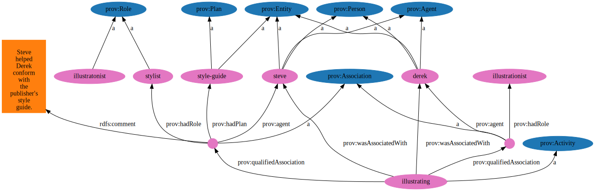

# Explorar o conteúdo lido de um grafo codificado em Turtle

2021-03-16, 2021-03-17

Feito das 13:39 até as 18:41,

Documentado das 11:20 até as 13:40,

Revisão da documentaçao das 13:40 até 14:00

## Uso simples

- Popular e processar o grafo RDF (por exemplo fazendo consultas), a partir de um grafo modelo, e salvar resultados.

## Método

1. Copiar e executar [leitura de um grafo RDF armazenado em arquivo escrito em Turtle](LerTTLEmUmModel/README.md), que será modificado em seguida; 
2. Procurar a documentação de Jena para criar triplas em um grafo RDF e decidir o que fazer.
   - É uma mistura do tutorial 1 com o tutorial 6 de [Jena RDF API](https://jena.apache.org/tutorials/rdf_api.html), com algumas coisas a mais;
   - [Como executar os tutoriais](ExecucaoTutoriaisJena.md);
   - [Como instalar Jena](InstalaJena.md);
2. Após análise do código e da documentação, a solução escolhida é, após carregar o grafo RDF, buscar os predicados e recursos, usá-los para codificar a criação e inserção da nova tripla ao grafo, compilar, executar e avaliar o resultado em um processo iterativo, ou dar uma desistência BEM justificada.

## Resultados

### Documentação relevante

### Jena

- https://jena.apache.org/tutorials/rdf_api.html
- https://jena.apache.org/documentation/javadoc/jena/org/apache/jena/rdf/model/StmtIterator.html
- https://jena.apache.org/documentation/javadoc/jena/org/apache/jena/rdf/model/Statement.html
- https://jena.apache.org/documentation/javadoc/jena/org/apache/jena/rdf/model/ModelCon.html#createResource-org.apache.jena.rdf.model.Resource-
- https://jena.apache.org/documentation/javadoc/jena/org/apache/jena/rdf/model/ModelCon.html#getRDFNode-org.apache.jena.graph.Node-
- https://jena.apache.org/documentation/javadoc/jena/org/apache/jena/rdf/model/Model.html#listObjects--
- https://jena.apache.org/documentation/javadoc/jena/org/apache/jena/rdf/model/NodeIterator.html
- https://jena.apache.org/documentation/javadoc/jena/org/apache/jena/rdf/model/RDFNode.html
- https://stackoverflow.com/questions/17009154/get-rdfnode-from-jena-resultset
- https://www.programcreek.com/java-api-examples/?api=org.apache.jena.rdf.model.Model
- https://jena.apache.org/documentation/javadoc/jena/org/apache/jena/vocabulary/VCARD.html

### Listas e Iteradores

- https://docs.oracle.com/javase/8/docs/api/java/util/List.html
- https://docs.oracle.com/javase/8/docs/api/java/util/Iterator.html
- https://www.w3schools.com/java/java_iterator.asp

### Strings: buscas de padrões e expressões regulares 

- https://docs.oracle.com/javase/7/docs/api/java/lang/String.html#matches(java.lang.String)
- https://docs.oracle.com/javase/7/docs/api/java/util/regex/Pattern.html#sum
- https://www.w3schools.com/java/java_ref_string.asp
- https://www.vogella.com/tutorials/JavaRegularExpressions/article.html


### Memória de Testes

A cópia e execução de LeTTL pode ser comprovada nesta [captura de tela](Captura%20de%20tela%20de%202021-03-16%2013-52-44.png).

A partir daí, procura algo interessante para explorar os dados. Eu comecei pela documentação de Model e achei interessante listar os nós. Codifiquei algo muito parecido com o que está no [Tutorial 6](ExecucaoTutoriaisJena.md#tutorial-6).

[Código arquivado](LeTTL-arquivo-1.java) 

Pensei em como criar novos Statement a partir dos Statement já existentes. Por exemplo, se quero instanciar um novo prov:Activity e já existe um Statement SPO que diz, por exemplo `:illustrating a prov:Activity; `, a mim, faz sentido, usar o mesmo objeto para instanciar algo como `123124353 a prov:Activity`. Não faz tanto sentido usar a mesma propriedade, mas acho que funciona. Então, encontrar esse Statement e reusar o Predicado e o Objeto parece ser bom.

Para encontrar o Statement, a melhor forma que encontrei foi buscar aquele que contém o sujeito, predicado ou objeto que me interessa, cuja representação como String (`.toString`) coincide com o padrão que desejo - para isso usei `String.matches(p)`, que usa expressões regulares. Sobre a ontologia, isto pressupõe conhecer e saber usar as ontologias definidas e usadas no modelo, então, para documentação, convém apresentar a ontologia em algum diagrama. 

O programa que escrevi, por algum motivo que não descobri (na ocasião), não gerava o resultado esperado.

[Código arquivado](LeTTL-arquivo-2.java) 

Achei que era por conta da forma como tentei inserir o Statement. Decidi voltar aos tutoriais. Foi aí que percebi a semelhança com Tutorial 6. Ajustei o código, continuou não dando o resultado esperado. Na depuração percebi que o código que cria a tripla não era executado, logo, era erro na definição da expressão regular. Isto ajustado, o resultado da execução foi o esperado:

[Primeiro código que deu o resultado esperado](LeTTL-arquivo-3.java)

Há dois testes que se tornaram oportunos:

- abreviar a URI na criação do Resource (quero que seja abreviada)
- usar `model.add(Statement)`, como nos códigos-arquivo 1 e 2.

No primeiro teste ocorreu erro:

<pre>http://www.w3.org/ns/prov#Entity
http://www.w3.org/ns/prov#Agent
http://www.w3.org/ns/prov#Person
criando minha tripla.
Exception in thread &quot;main&quot; org.apache.jena.shared.BadURIException: Only well-formed absolute URIrefs can be included in RDF/XML output: &lt;:12354353&gt; Code: 9/EMPTY_SCHEME in SCHEME: The scheme component is empty.
	at org.apache.jena.rdfxml.xmloutput.impl.BaseXMLWriter.checkURI(BaseXMLWriter.java:832)
	at org.apache.jena.rdfxml.xmloutput.impl.BaseXMLWriter.relativize(BaseXMLWriter.java:810)
	at org.apache.jena.rdfxml.xmloutput.impl.Unparser.wURIreference(Unparser.java:925)
	at org.apache.jena.rdfxml.xmloutput.impl.Unparser.wURIreference(Unparser.java:929)
</pre>

Conclusão: Jena não permite abreviar URIs (ao menos da maneira como tentei): Erro quando tentei abreviar a URI:

[Código com URI abreviada dá erro](LeTTL-arquivo-4.java)

O segundo teste compilou, executou e apresentou o resultado esperado.

<pre><font color="#859900"><b>fabio@fabio-13Z940-G-BK71P1</b></font>:<font color="#268BD2"><b>~/Documentos/ZZfiles/sobreJena/programas/ExplorarOTTLLido</b></font>$ ls
<font color="#D33682"><b>&apos;Captura de tela de 2021-03-16 13-52-44.png&apos;</b></font>   LeTTL-arquivo-3.java
 <font color="#D33682"><b>exemplo51.svg</b></font>                                 LeTTL-arquivo-4.java
 exemplo51.ttl                                 LeTTL.class
 LeTTL-arquivo-1.java                          LeTTL.java
 LeTTL-arquivo-2.java                          README.md
<font color="#859900"><b>fabio@fabio-13Z940-G-BK71P1</b></font>:~/Documentos/ZZfiles/sobreJena/programas/ExplorarOTT<font color="#268BD2"><b>LLido</b></font>$ javac -Xlint:deprecation -cp &apos;.:/home/fabio/apache-jena-3.17.0/lib/*&apos; LeTTL.java
<font color="#859900"><b>fabio@fabio-13Z940-G-BK71P1</b></font>:~/Documentos/ZZfiles/sobreJena/programas/ExplorarOTT<font color="#268BD2"><b>LLido</b></font>$ java -cp &apos;.:/home/fabio/apache-jena-3.17.0/lib/*&apos; LeTTL
f5a2c144272ea657228f5ee802d56ce2
475cded884dfa8a6649d287733c02a64
http://example.com/steve
http://example.com/derek
http://www.w3.org/ns/prov#Activity
ACHEI![http://example.com/illustrating, http://www.w3.org/1999/02/22-rdf-syntax-ns#type, http://www.w3.org/ns/prov#Activity]
http://www.w3.org/ns/prov#Entity
http://www.w3.org/ns/prov#Plan
http://www.w3.org/ns/prov#Entity
http://www.w3.org/ns/prov#Agent
http://www.w3.org/ns/prov#Person
http://www.w3.org/ns/prov#Role
http://example.com/illustrationist
http://example.com/derek
http://www.w3.org/ns/prov#Association
Steve helped Derek conform with the publisher&apos;s style guide.@en
http://example.com/style-guide
http://example.com/stylist
http://example.com/steve
http://www.w3.org/ns/prov#Association
http://www.w3.org/ns/prov#Role
http://www.w3.org/ns/prov#Entity
http://www.w3.org/ns/prov#Agent
http://www.w3.org/ns/prov#Person
&lt;rdf:RDF
    xmlns:rdf=&quot;http://www.w3.org/1999/02/22-rdf-syntax-ns#&quot;
    xmlns:owl=&quot;http://www.w3.org/2002/07/owl#&quot;
    xmlns:prov=&quot;http://www.w3.org/ns/prov#&quot;
    xmlns=&quot;http://example.com/&quot;
    xmlns:rdfs=&quot;http://www.w3.org/2000/01/rdf-schema#&quot;
    xmlns:xsd=&quot;http://www.w3.org/2001/XMLSchema#&quot;&gt;
  &lt;prov:Activity rdf:about=&quot;http://example.com/illustrating&quot;&gt;
    &lt;prov:qualifiedAssociation&gt;
      &lt;prov:Association&gt;
        &lt;rdfs:comment xml:lang=&quot;en&quot;&gt;Steve helped Derek conform with the publisher&apos;s style guide.&lt;/rdfs:comment&gt;
        &lt;prov:hadPlan&gt;
          &lt;prov:Entity rdf:about=&quot;http://example.com/style-guide&quot;&gt;
            &lt;rdf:type rdf:resource=&quot;http://www.w3.org/ns/prov#Plan&quot;/&gt;
          &lt;/prov:Entity&gt;
        &lt;/prov:hadPlan&gt;
        &lt;prov:hadRole&gt;
          &lt;prov:Role rdf:about=&quot;http://example.com/stylist&quot;/&gt;
        &lt;/prov:hadRole&gt;
        &lt;prov:agent&gt;
          &lt;prov:Entity rdf:about=&quot;http://example.com/steve&quot;&gt;
            &lt;rdf:type rdf:resource=&quot;http://www.w3.org/ns/prov#Agent&quot;/&gt;
            &lt;rdf:type rdf:resource=&quot;http://www.w3.org/ns/prov#Person&quot;/&gt;
          &lt;/prov:Entity&gt;
        &lt;/prov:agent&gt;
      &lt;/prov:Association&gt;
    &lt;/prov:qualifiedAssociation&gt;
    &lt;prov:qualifiedAssociation&gt;
      &lt;prov:Association&gt;
        &lt;prov:hadRole rdf:resource=&quot;http://example.com/illustrationist&quot;/&gt;
        &lt;prov:agent&gt;
          &lt;prov:Entity rdf:about=&quot;http://example.com/derek&quot;&gt;
            &lt;rdf:type rdf:resource=&quot;http://www.w3.org/ns/prov#Agent&quot;/&gt;
            &lt;rdf:type rdf:resource=&quot;http://www.w3.org/ns/prov#Person&quot;/&gt;
          &lt;/prov:Entity&gt;
        &lt;/prov:agent&gt;
      &lt;/prov:Association&gt;
    &lt;/prov:qualifiedAssociation&gt;
    &lt;prov:wasAssociatedWith rdf:resource=&quot;http://example.com/steve&quot;/&gt;
    &lt;prov:wasAssociatedWith rdf:resource=&quot;http://example.com/derek&quot;/&gt;
  &lt;/prov:Activity&gt;
  <font color="#D33682"><b>&lt;prov:Activity rdf:about=&quot;http://example.com/12354353&quot;/&gt;</b></font>
  &lt;prov:Role rdf:about=&quot;http://example.com/illustratonist&quot;/&gt;
&lt;/rdf:RDF&gt;
<font color="#859900"><b>fabio@fabio-13Z940-G-BK71P1</b></font>:<font color="#268BD2"><b>~/Documentos/ZZfiles/sobreJena/programas/ExplorarOTTLLido</b></font>$ 

</pre>

[Código final](LeTTL.java)


## Conclusão (sumário de resultados)

O código-fonte desenvolvido está no [arquivo](LeTTL.java). Versões intermediárias, para documentação, foram criadas e explicadas na memória de teste.

O código foi compilado e executado. O resultado é o esperado (ié Funcionou).

Comando para compilação:

`javac -Xlint:deprecation -cp '.:/home/fabio/apache-jena-3.17.0/lib/*' LeTTL.java`

Comando para execução:

`java -cp '.:/home/fabio/apache-jena-3.17.0/lib/*' LeTTL`

Na criação de novo `Resource`, com `.createResource(URI)`, Jena não permite abreviar URIs.

Há ao menos duas formas de inserir tripla no grafo RDF. Através de `.addProperty()`, ou de `.addStatement`. Testadas em LeTTL-arquivado-3.java:

```java
        Model model = ModelFactory.createDefaultModel();
/*....*/
          Resource minhaTripla = model.createResource("http://example.com/12354353");
          minhaTripla.addProperty(pType, noActivity);

```

e em LeTTL.java, respectivamente.

```java
        Model model = ModelFactory.createDefaultModel();
/*....*/
          Resource umNo = model.createResource ("http://example.com/12354353");
          Statement novoStatement = model.createStatement(umNo, pType, noActivity);
          model.add(novoStatement);
```
## Discussão.

Em Jena, as triplas são chamadas Statement e as owl:Property são chamadas predicados. Inclusive, em Jena, property e predicate são usados e referem-se a entidades diferentes.

Para avaliar os resultados é conveniente apresentar a representação gráfica do grafo RDF:



Interessante notar:

- os prefixos foram expandidos e tem nós anônimos, correspondem aos dois hashCodes no primeiro teste da Memória de teste;
- instâncias de prov:Activity são definidas;
- não existe instância "http://example.com/12354353".

A maneira como foram encontrados os predicados e recursos, para então definir novas triplas mantém a consistência interna do modelo, mas requer que existam triplas que sirvam para compor o que se deseja, o que pode ser limitante em vários aspectos. Por outro lado, as triplas do modelo podem ser removidas com `.remove()`, quando não forem mais necessárias.

A busca por uma tripla que sirva como exemplo é feita por busca linear.

Nos tutoriais da API RDF de Jena, isto é substituído pelo uso de ontologias pré-carregadas, como VCARD.

A possibilidade de escrever programas como este sem conhecer as ontologias utilizadas é um tema a explorar, já que, no momento, para escrever o programa é necessário conhecer a ontologia e parece não haver alternativa.

## Histórico

## 2021-03-16-134942

Faz cópia da pasta LeTTL, remove informação de arquivo e de desenvolvimento do projeto anterior, compila, executa e checa resultado.

[alt text](Captura%20de%20tela%20de%202021-03-16%2013-52-44.png)

## 2021-03-16-135342

Procura algo interessante para explorar os dados. Eu comecei pela documentação de Model e achei interessante listar os nós.

- https://jena.apache.org/documentation/javadoc/jena/org/apache/jena/rdf/model/Model.html
- https://jena.apache.org/documentation/javadoc/jena/org/apache/jena/rdf/model/Model.html#listObjects--
- https://jena.apache.org/documentation/javadoc/jena/org/apache/jena/rdf/model/NodeIterator.html
- https://jena.apache.org/documentation/javadoc/jena/org/apache/jena/rdf/model/RDFNode.html

## 2021-03-16-140417

<pre><font color="#859900"><b>fabio@fabio-13Z940-G-BK71P1</b></font>:<font color="#268BD2"><b>~/Documentos/ZZfiles/sobreJena/programas/ExploararOTTLLido</b></font>$ javac -Xlint:deprecation -cp &apos;.:/home/fabio/apache-jena-3.17.0/lib/*&apos; LeTTL.java
<font color="#859900"><b>fabio@fabio-13Z940-G-BK71P1</b></font>:<font color="#268BD2"><b>~/Documentos/ZZfiles/sobreJena/programas/ExploararOTTLLido</b></font>$ java -cp &apos;.:/home/fabio/apache-jena-3.17.0/lib/*&apos; LeTTL
http://www.w3.org/ns/prov#Entity
http://example.com/style-guide
3ebe6feb7cc81299d736e9231d946b40
http://www.w3.org/ns/prov#Association
http://example.com/steve
Steve helped Derek conform with the publisher&apos;s style guide.@en
http://www.w3.org/ns/prov#Person
0ea40f2da1b741dda15a9f71b1cd4b2a
http://www.w3.org/ns/prov#Activity
http://www.w3.org/ns/prov#Role
http://example.com/stylist
http://www.w3.org/ns/prov#Plan
http://example.com/illustrationist
http://example.com/derek
http://www.w3.org/ns/prov#Agent
<font color="#859900"><b>fabio@fabio-13Z940-G-BK71P1</b></font>:<font color="#268BD2"><b>~/Documentos/ZZfiles/sobreJena/programas/ExploararOTTLLido</b></font>$ cp LeTTL.java LeTTL-arquivo-1.java 
</pre>

[Código arquivado](LeTTL-arquivo-1.java) 

Informação auxiliar do projeto ontology-visualization. Representação gráfica do grafo de conhecimento.

[alt text](exemplo51.svg)

Interessante notar que os prefixos foram expandidos e tem dois hashCode, que são os nós anônimos.

## 2021-03-16-163434

Pensei em como criar novos Statement a partir dos Statement já existentes. Por exemplo, se quero instanciar um novo prov:Activity e já existe um Statement SPO que diz, por exemplo `:illustrating a prov:Activity; `, a mim, faz sentido, usar o mesmo objeto para instanciar algo como `123124353 a prov:Activity`. Não faz tanto sentido usar a mesma propriedade, mas acho que funciona. Então, encontrar esse Statement e reusar o Predicado e o Objeto parece ser bom.

## 2021-03-16-180926

[Primeiro código que deu o resultado esperado](LeTTL-arquivo-3.java)

Jena não permite abreviar URIs (ao menos da maneira como tentei): Erro quando tentei abreviar a URI:

<pre>http://www.w3.org/ns/prov#Entity
http://www.w3.org/ns/prov#Agent
http://www.w3.org/ns/prov#Person
criando minha tripla.
Exception in thread &quot;main&quot; org.apache.jena.shared.BadURIException: Only well-formed absolute URIrefs can be included in RDF/XML output: &lt;:12354353&gt; Code: 9/EMPTY_SCHEME in SCHEME: The scheme component is empty.
	at org.apache.jena.rdfxml.xmloutput.impl.BaseXMLWriter.checkURI(BaseXMLWriter.java:832)
	at org.apache.jena.rdfxml.xmloutput.impl.BaseXMLWriter.relativize(BaseXMLWriter.java:810)
	at org.apache.jena.rdfxml.xmloutput.impl.Unparser.wURIreference(Unparser.java:925)
	at org.apache.jena.rdfxml.xmloutput.impl.Unparser.wURIreference(Unparser.java:929)
</pre>

[Código com URI abreviada dá erro](LeTTL-arquivo-4.java)

## 2021-03-16-183151

Voltei para o código que usa `model.add(Statement)`. Desta vez o resultado foi o esperado. O erro estava na expressão regular que usei no String.matches(S).

Estas são as referências que consultei. Na elaboração da documentação deste exemplo vou selecionar as que trouxeram informação útil.

https://stackoverflow.com/questions/1671378/java-get-first-item-from-a-collection
https://www.google.com/search?channel=fs&client=ubuntu&q=List+class+java8
https://docs.oracle.com/javase/8/docs/api/java/util/List.html
https://docs.oracle.com/javase/8/docs/api/java/util/Iterator.html


https://www.google.com/search?channel=fs&client=ubuntu&q=java+iterator+examples
https://www.w3schools.com/java/java_iterator.asp


https://www.google.com/search?channel=fs&client=ubuntu&q=java+String+contains
https://docs.oracle.com/javase/7/docs/api/java/lang/String.html#matches(java.lang.String)
https://docs.oracle.com/javase/7/docs/api/java/util/regex/Pattern.html#sum
https://www.w3schools.com/java/java_ref_string.asp
file:///home/fabio/Documentos/ZZfiles/sobreJena/programas/ExploararOTTLLido/README.md
https://www.google.com/search?channel=fs&client=ubuntu&q=java+String.matches+examples
https://www.vogella.com/tutorials/JavaRegularExpressions/article.html


https://www.w3.org/TR/prov-o/#hadActivity
https://github.com/FNakano/Gestao/blob/main/LerTTLEmUmModel/README.md
https://jena.apache.org/tutorials/rdf_api.html#ch-Introduction
https://www.google.com/search?channel=fs&client=ubuntu&q=jena+constant+classes+for+schemas
https://jena.apache.org/documentation/tools/schemagen.html
https://www.google.com/search?channel=fs&client=ubuntu&q=jena+model
https://jena.apache.org/documentation/javadoc/jena/org/apache/jena/rdf/model/Model.html#createStatement-org.apache.jena.rdf.model.Resource-org.apache.jena.rdf.model.Property-org.apache.jena.rdf.model.RDFNode-
https://jena.apache.org/documentation/javadoc/jena/org/apache/jena/rdf/model/StmtIterator.html
https://jena.apache.org/documentation/javadoc/jena/org/apache/jena/rdf/model/Statement.html
https://jena.apache.org/documentation/javadoc/jena/org/apache/jena/rdf/model/ModelCon.html#createResource-org.apache.jena.rdf.model.Resource-
https://jena.apache.org/documentation/javadoc/jena/org/apache/jena/rdf/model/ModelCon.html#getRDFNode-org.apache.jena.graph.Node-
https://jena.apache.org/documentation/javadoc/jena/org/apache/jena/graph/Node.html#getURI--
https://jena.apache.org/documentation/javadoc/jena/org/apache/jena/rdf/model/Model.html#listObjects--
https://jena.apache.org/documentation/javadoc/jena/org/apache/jena/rdf/model/NodeIterator.html
https://jena.apache.org/documentation/javadoc/jena/org/apache/jena/rdf/model/RDFNode.html
https://jena.apache.org/documentation/javadoc/jena/org/apache/jena/rdf/model/ModelFactory.html
https://www.google.com/search?channel=fs&client=ubuntu&q=jena+rdfnodefactory
https://jena.apache.org/documentation/javadoc/jena/org/apache/jena/rdf/model/impl/ResourceImpl.html#rdfNodeFactory
https://www.google.com/search?client=ubuntu&hs=8ob&channel=fs&sxsrf=ALeKk02P_D65nIuZhRCaznSIt1SrBF_VKw%3A1615915926340&ei=lutQYOS3FPfH5OUP2K-TqAc&q=jena+get+rdfnode+by+uri&oq=jena+get+rdfnode+by+uri&gs_lcp=Cgdnd3Mtd2l6EAM6BwgAEEcQsANQyFZYhltgjl1oAXACeACAAcEBiAG4BZIBAzAuNJgBAKABAaoBB2d3cy13aXrIAQLAAQE&sclient=gws-wiz&ved=0ahUKEwjk2pr2q7XvAhX3I7kGHdjXBHUQ4dUDCAw&uact=5
https://jena.apache.org/documentation/javadoc/jena/org/apache/jena/rdf/model/RDFNode.html
https://stackoverflow.com/questions/17009154/get-rdfnode-from-jena-resultset
https://www.google.com/search?channel=fs&client=ubuntu&q=jena+model.add+example
https://www.programcreek.com/java-api-examples/?api=org.apache.jena.rdf.model.Model
https://jena.apache.org/tutorials/rdf_api.html#ch-Operations-on-Models
https://www.google.com/search?channel=fs&client=ubuntu&q=jena+VCARD.FN
https://jena.apache.org/documentation/javadoc/jena/org/apache/jena/vocabulary/VCARD.html

## 2021-03-17-112421

Começando documentação

## 2021-03-17-122114

Pausa para o almoço

## 2021-03-17-130040

Reinício

