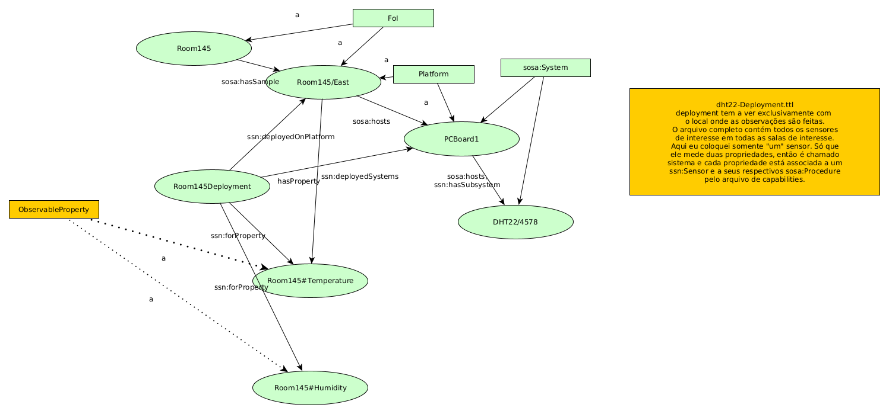

# SSN e SOSA: como os dados enviados/coletados são armazenados/referenciados?

## Motivação

Quando fui estudar (pela segunda vez) o [vocabulário de SSN e SOSA](https://www.w3.org/TR/vocab-ssn/), escolhi dar atenção ao exemplo usando [DHT22](https://www.baudaeletronica.com.br/sensor-de-temperatura-e-umidade-dht22.html). Este é o código de um sensor de temperatura e umidade relativa do ar muito comum.

Nesse exemplo, da forma como fiz, não achei como os dados gerados pelos sensores são armazenados então, desta vez, resolvi ser mais sistemático.

Um interesse mais recente está em como usar `sosa:Procedure`, e se é usável para armazenar informação sobre como criar uma aplicação que lê o sensor, ou, a linha de comando que lê o sensor, ou como criar o endpoint para que o sensor envie dados.
 
## Objetivo

Encontrar como os dados gerados pelos sensores são armazenados e explorar como usar `sosa:Procedure`.

## Método

Escolher um nó relativo a um sensor (importante: seguindo todos os caminhos a partir do nó, consigo percorrer todo o componente conexo do grafo de conhecimento). Criar diagrama(s) contendo todas as propriedades, classes e instâncias que se relacionam ao nó selecionado (como isto inclui outros sensores, que não me interessam, tenho um critério de corte *ad-hoc*).

Caso, depois da aplicação da estratégia acima ainda não houver resposta, varrer o restante dos exemplos.

## Resultados

No exemplo há dois arquivos contendo a base de conhecimento em formato turtle. Um [descreve o(s) sensor(es)](https://www.w3.org/TR/vocab-ssn/#dht22-description), outro [descreve sua implantação (deployment)](https://www.w3.org/TR/vocab-ssn/#dht22-deployment). Abri o que descreve a implantação, escolhi o ~~sensor~~ `<DHT22/4578>`.

Diagrama 1: Relações de `<DHT22/4578>` no arquivo que descreve sua implantação.



Diagrama 2: Relações de `<DHT22/4578>` nos arquivos que descrevem implantação e capabilities.


Com a informação até aqui, não fui capaz de entender como os dados são armazenados nem como usar `sosa:Procedure`. Olhando os exemplos:


```
...

# The barometric readings from a Bosch Sensortec BMP282 sensor in an Apple IPhone 7
# observed on June 6 2017 using only the SOSA core for modelling.

<earthAtmosphere> rdf:type sosa:FeatureOfInterest ;
  rdfs:label "Atmosphere of Earth"@en .

...

# An observation made by the BMP282 atmospheric pressure sensor.

<Observation/346344> rdf:type sosa:Observation ;
  sosa:observedProperty <sensor/35-207306-844818-0/BMP282/atmosphericPressure> ;
  sosa:hasFeatureOfInterest  <earthAtmosphere> ;
  sosa:madeBySensor <sensor/35-207306-844818-0/BMP282> ;
  sosa:hasSimpleResult "1021.45 hPa"^^cdt:ucum ;
  sosa:resultTime "2017-06-06T12:36:12Z"^^xsd:dateTime .
```

O exemplo acima resolve a questão de como armazenar uma observação com uma instância de SimpleResult.

Fonte: https://www.w3.org/TR/vocab-ssn/#b-1-iphone-barometer

O trecho abaixo mostra o uso típico de `sosa:Procedure` nos exemplos.

```
 <MeasuringRelativeHumidity> a sosa:Procedure ;
   rdfs:comment "Instructions for measuring relative humidity"@en .
```

Fonte: https://www.w3.org/TR/vocab-ssn/#b-2-coal-oil-point-reserve
 
Embora sosa:Procedure mencione algoritmo, nos exemplos, não contém informação sobre o programa/linha de comando, mas, sim, instruções destinadas a pessoas.

O trecho abaixo mostra que a instância de um `sosa:Observation` pode conter a relação com `sosa:Procedure`.

``` 
 <RH_avg_1_COPR_15min_201706020300PM> a sosa:Observation ;
   rdfs:comment "Relative humidity as averaged over 15min at COPR."@en ;
   rdfs:label "Relative humidity, AVG, 15min, COPR, 06.02.2017, 3:00 PM"@en ;
   sosa:madeBySensor <HUMICAP-H> ;
   sosa:hasFeatureOfInterest <COPR_Station_Location> ;
   sosa:hasSimpleResult "92.5 %"^^cdt:ucum ;
   sosa:resultTime "2017-06-02-T03:00:00-7:00"^^xsd:dateTime ;
   sosa:observedProperty <RelativeHumidity> ;
   sosa:usedProcedure <MeasuringRelativeHumidity> .
```

Fonte: https://www.w3.org/TR/vocab-ssn/#b-2-coal-oil-point-reserve

Este exemplo esclarece como a observação pode ser associada à propriedade associada a um lugar. O alcance de [sosa:observedProperty](https://www.w3.org/TR/vocab-ssn/#SOSAobservedProperty) inclui sosa:ObservableProperty, esta deve ser associada a sosa:FeatureOfInterest. É possível associar o local através da propriedade sosa:hasFeatureOfInterest. Isto me parece redundante, mas pode existir algo que não sei e que torna isso necessário.

Diagrama 3:  Relações de `<DHT22/4578>` nos arquivos que descrevem implantação e capabilities; acrescido de relações que fazem sentido dada a informação obtida dos outros exemplos.


## Discussão e conclusão

A [relação criada por sosa:implements e por sosa:implementedBy](https://www.w3.org/TR/vocab-ssn/#SSNimplements) envolve uma entidade e um sosa:Procedure. Ela é ampla o suficiente para associar a cada instância de ssn:Sensor uma instância de sosa:Procedure, desta forma, o IRI do Procedure pode ser a URL acessada para ler o sensor (se o sensor for servidor), e o sistema que interpreta a ontologia cria/executa a chamada, por exemplo usando CURL. 

E se o sensor for o cliente? Aí pode ser a URL para onde o sensor faz GET e o sistema que interpreta a ontologia cria essa URL para o sensor poder enviar os dados.


