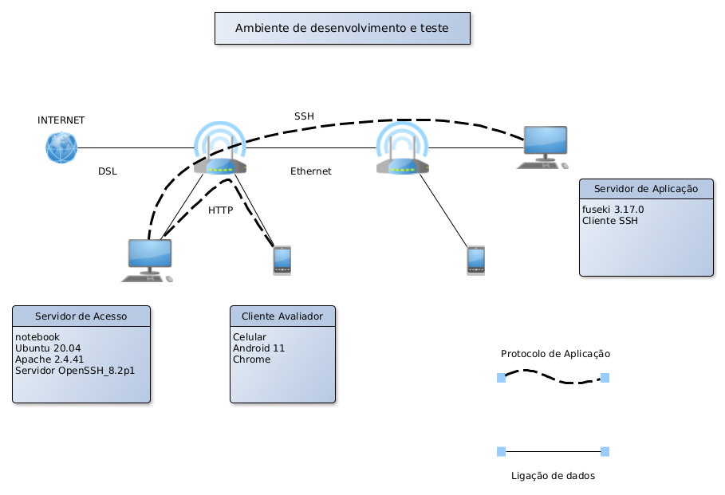
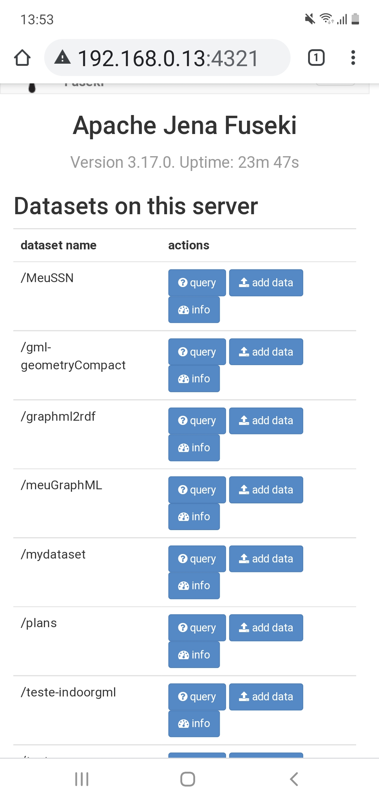

# Acesso a um servidor de desenvolvimento local, via Internet, por proxy reverso

**nota**: O [histórico de desenvolvimento](diario.md) apresenta e traz comentários que mostram que o trabalho não foi linear e que foi mais confuso que o usual.

## Motivação

Em trabalhos de desenvolvimento de Sistemas de Informação, é frequente desenvolver servidores web em computadores locais (dos laboratórios, docentes ou alunos) que não são acessíveis através da Internet.

É um tanto paradoxal que alguém desenvolva um servidor web que não é acessível através da Internet. Passando do campo dos conceitos para a prática, nos trabalhos que resultam nos relatórios, monografias e artigos, frequentemente (para não dizer sempre), é conveniente que várias pessoas em lugares diferentes e simultaneamente possam acessar o servidor web que está em desenvolvimento. Seja para continuar o desenvolvimento, discutir com colaboradores, apresentar a clientes e examinadores,...

São diversos os motivos que levam a essa situação, não é objetivo deste trabalho enumerá-los todos, então fica-se com este: Há dificuldades burocráticas e/ou econômicas para conseguir e operar IPs e nomes de domínio públicos. Para manter a discussão sobre este assunto simples, superficial e efetiva: Em geral as empresas que provêem IPs e nomes, seja este seu negócio principal ou não, ou cobram por isso ou oferecem gratuidade por período limitado, e, qualquer que seja a empresa, limita a funcionalidade e/ou cobra adicional por ela. Por exemplo, Amazon EC2 e Microsoft Azure oferecem VPS gratuito por um ano. Heroku (Salesforce) oferece um serviço de containers que limita funcionalidade e disponibilidade (se não houver acesso ao site, este pode ser desligado, sendo religado *on demand*, o que costuma levar vários segundos). Caso escolha-se o serviço pago, o pagamento é feito por cartão de crédito internacional que fica cadastrado junto à empresa. Nem todas as pessoas têm cartão internacional, existe quem não queira ter, manter o cartão tem custo e gera risco de roubo ou furto físico e/ou virtual.

Neste trabalho apresenta-se uma solução para desenvolvedores permitirem acesso controlado, através da Internet, a servidores web, geralmente instalados nos computadores dos desenvolvedores, sem IP público. A utilidade da proposta está em permitir que, em ocasiões controladas pelo desenvolvedor, colaboradores, clientes e avaliadores possam acessar os servidores. 

##### Estrutura da solução

A solução não é novidade. Ela é baseada em um servidor HTTP funcionando como proxy para os servidores dos desenvolvedores. A conexão entre o proxy e o servidor do desenvolvedor é feita por SSH.**nota**: é necessário um servidor com IP público, que pode ser mantido (custeado) por alguém com vínculo mais duradouro com a instituição. Este servidor pode ser compartilhado com vários desenvovedores, que têm vínculo temporário, e que, ao final da utilização do servidor proxy, podem ter suas credenciais removidas do servidor.

Colaboradores e avaliadores usam o navegador dos seus computadores ou celulares para acessar um site no Servidor de Acesso. De maneira transparente, caso o site esteja hospedado em outro servidor - o Servidor de Aplicação - instalado no computador do desenvolvedor, as requisições HTTP enviadas para o Servidor de Acesso são encaminhadas para o Servidor de Aplicação. Esse encaminhamento é feito através de uma conexão SSH iniciada no Servidor de Aplicação. Esta forma de conexão é chamada Túnel Reverso SSH. Ver Figura 1.


Figura 1: As ligações de dados sem indicação são feitas por wi-fi.

Fonte: O autor

##### Desenvolvimento

O autor tem à disposição uma hospedagem em VPS com IP público que é usada em projetos em etapa crítica de desenvolvimento (leia-se entrega e avaliação de TCC). Para evitar modificações na hospedagem, com chance de "quebra" dos projetos, pensou-se em assinar mais uma hospedagem. Ao invés disso, optou por desenvolver a solução localmente e aguardar a conclusão do TCC. No desenvolvimento local, o Servidor de Acesso e os clientes ficam todos na mesma rede local, como mostrado na figura 2.

Figura 2: As ligações de dados sem indicação são feitas por wi-fi.

Fonte: O autor

###### Implantação do sistema de desenvolvimento

Programas e configurações específicas são feitas somente no Servidor de Acesso e no Servidor de Aplicação. 

No Servidor de Acesso, cujo IP "público" é 192.168.0.13, há instalado Ubuntu, Apache - [instruções para instalação](diario.md#apache) - e servidor SSH - [instruções para instalação](diario.md#instalar-servidor-ssh-no-ubuntu). O desenvolvedor deve ter um usuário no Ubuntu do Servidor de Acesso (cria-se usuários usando `adduser`).

A fim de manter um site testável, acrescentou-se um site no Apache, na porta 4321, configurado como proxy. Os módulos do Apache para seu funcionamento como proxy não são habilitados na instalação padrão. Para habilitá-los, usar os comandos:

1. `sudo a2enmod proxy`
2. `sudo a2enmod proxy_http`
3. `sudo a2enmod proxy_balancer`
4. `sudo a2enmod lbmethod_byrequests`
5. `sudo systemctl restart apache2`

[Mais informação aqui](diario.md#proxy-reverso).

Para o Apache escutar a porta 4321, acrescente `Listen 4321` em `/etc/apache2/ports.conf` (há mais configurações a fazer, então pode deixar para reiniciar o apache depois). [Mais informação aqui](diario.md#virtual-hosts)

Para criar o site na porta 4321 e encaminhar as requisições para a porta 1234 (explicação no servidor de aplicação), acrescentar o fragmento de código abaixo no arquivo `/etc/apache2/sites-available/000-default.conf`. [Mais informação aqui](diario.md#voltando-ao-proxy-reverso)

```
 <VirtualHost *:4321>

    ProxyPreserveHost On
    ProxyPass / http://127.0.0.1:1234/
    ProxyPassReverse / http://127.0.0.1:1234/

</VirtualHost>

```

Reiniciar o apache com `sudo systemctl restart apache2`

Por padrão, todas as portas de um computador estão desabilitadas, mesmo que o *firewall* do computador esteja desabilitado. Para checar no servidor de acesso se o *firewall* está habilitado, use `sudo ufw status verbose`. Se estiver inativo, ative com `sudo ufw enable`. Depois de ativar, habilitar a porta 4321 para acesso por tcp (protocolo de transporte sobre o qual é construído HTTP) com o comando `sudo ufw allow 4321/tcp`. As portas para conexão HTTP e SSH também precisam estar abertas, caso contrário as conexões serão recusadas (CONNECTION_REFUSED). [Mais informação aqui](diario.md#ufw)

No Servidor de Aplicação, além do servidor propriamente dito, no caso, Fuseki 3.17.0 ([mais sobre Fuseki aqui](https://jena.apache.org/documentation/fuseki2/)), é necessário um cliente SSH. Distribuições Linux o instalam por padrão. No Windows, o autor encontrou instruções usando puTTY, mas não as testou (e perdeu as referências).

O servidor Fuseki instalado standalone com interface de usuário ([uso do Fuseki standalone aqui](https://jena.apache.org/documentation/fuseki2/fuseki-webapp.html)) no Servidor de Aplicação, por padrão, escuta a porta 3030 do localhost (ié é acessado por http://localhost:3030). 

Um túnel reverso SSH cria no Servidor de Acesso uma porta para encaminhamento dos pacotes (requisições) para o Servidor de Aplicação. No exemplo, pode-se dizer que o túnel conecta a porta 3030 do Servidor de Aplicação à porta 1234 do Servidor de Acesso. O túnel é criado executando em um terminal no Servidor de Aplicação o seguinte comando:

`ssh -R 1234:localhost:3030 fabio@192.168.0.13`

O servidor SSH, por padrão, desconecta clientes inativos depois de um certo período de tempo. Para evitar a desconexão, é possível configurar o cliente para enviar um sinal de vida a intervalos regulares e por tempo determinado. Para isso:

- editar ou criar o arquivo ~/.ssh/config;
- acrescentar as linhas:
```
Host 192.168.0.13
    Hostname 192.168.0.13
    ServerAliveInterval 180
    ServerAliveCountMax 200
```
- salvar e conectar;


###### Resultado

Caso todos os passos tenham sido executados com sucesso, um navegador, como o do celular, acessará http://192.168.0.13:1234 e exibirá tela similar à apresentada abaixo:




Caso isto não aconteça, convém depurar o processo. Pontos de checagem podem ser definidos pelo conhecimento dos detalhes de cada ferramenta utilizada.

###### Discussão e Conclusão

Em uma hospedagem VPS específica com 1vCPU, 1GB de RAM e 20GB de armazenamento, o uso de RAM chega ao limite com a execução simultânea de Tomcat e Spring Boot. Com o proxy reverso, esse processamento é retirado do VPS e passado para o servidor de aplicação do desenvolvedor. Provavelmente o uso de RAM será menor quando implantar esta solução.

###### Próximos Passos

Implantar e testar sistema de produção.

1. Assinar um VPS;
2. Instalar Ubuntu;
   - criar usuários;
3. Seguir o procedimento apresentado neste tutorial.

término em <a id="2021-08-10-140354" href="#2021-08-10-140354">2021-08-10-140354</a>
