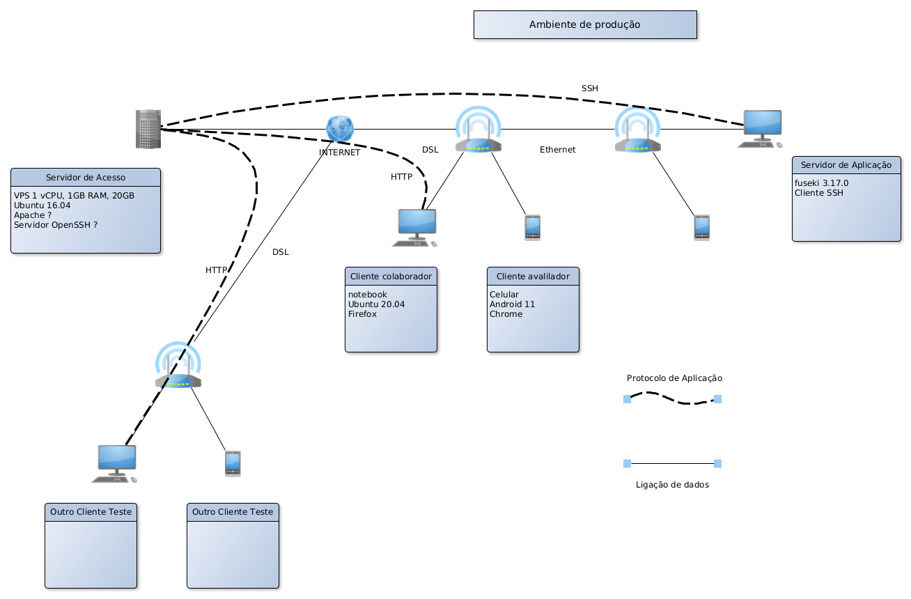
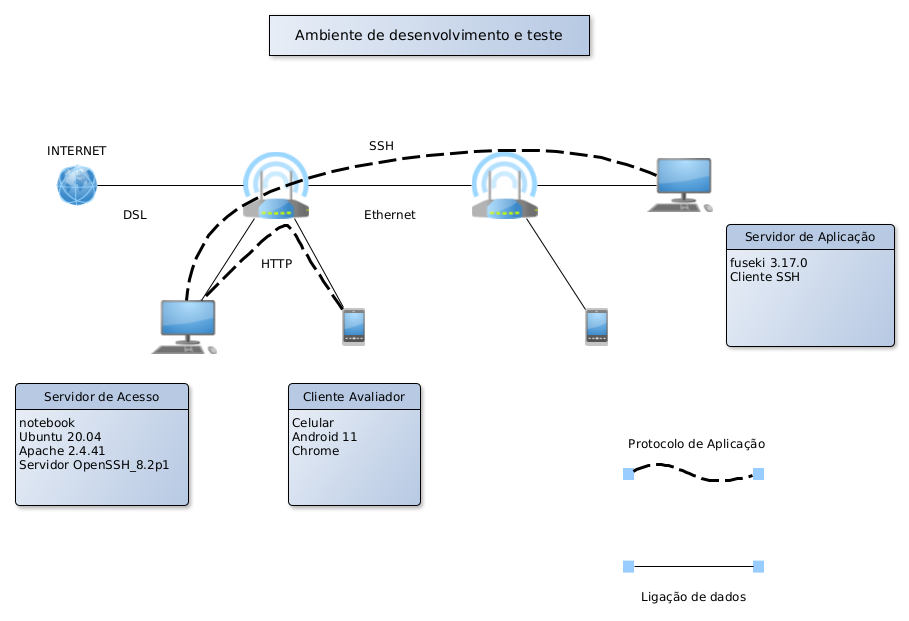
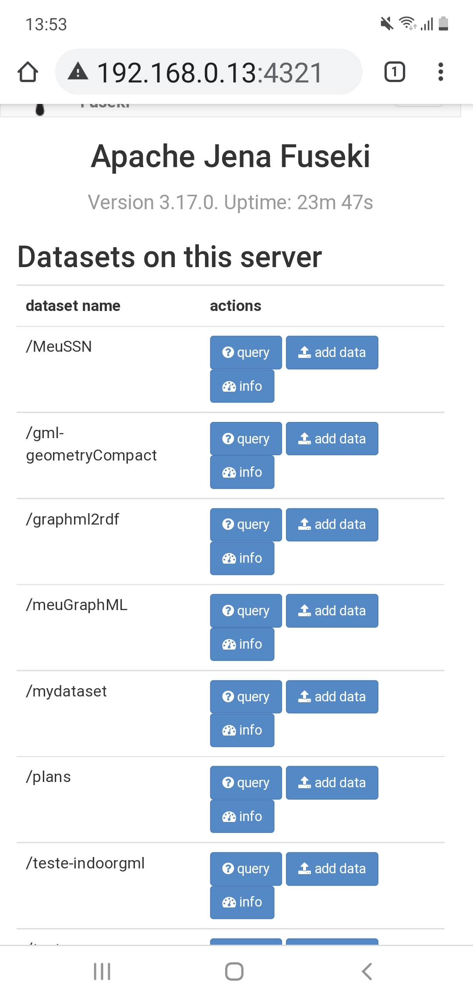

# Encaminhamento de pacotes
**um projeto mal pensado**

## Introdução

Hoje é <a id="2021-08-08-192003" href="#2021-08-08-192003">2021-08-08-192003</a>. Sexta passada combinei com colaboradores que configuraria um servidor web que encaminha as requisições para um servidor local. Acredito que eles entenderam o mesmo que eu pensei. Isto eu ainda vou ver.

O ponto é: *achei que iria resolver isso hoje, mas acho que cheguei (só) na metade do processo.*

1. Pensei que na semana passada eu tinha me informado suficientemente e que o procedimento era simples;
2. Pensei que tinha todas as referências que precisava;
3. Pelo que tinha entendido, seria *só* instalar um servidor web, configurar alguma coisinha e conectar por ssh.

**só que não...**

1. O contexto (http, ssh, rede, SO), é mais complicado do que eu esperava: entender o que se passa foi dificil;
2. Estou mais cansado do que imaginava, então tenho pouca paciência para ler, pensar e adaptar soluções;
3. (Acho que) Existem soluções que funcionavam em uma época e que agora não funcionam mais, só que, só se descobre isso depois de bater cabeça;
4. Chegou a um ponto em que eu não sabia sequer que palavra(s) procurar no Google.

No momento eu fiz algo, sei que progredi, mas estou um pouco frustrado pois não fiz tudo. Estou cansado, e, se eu tivesse que mostrar isto, do jeito como está, ao meu gestor interno, ele me esfolaria.

Vejo dois caminhos:

1. Virar noites para conseguir atingir o objetivo, entregar algo que, funcionando ou não, tem tanta coisa feita que eu continuaria sem saber como explicar, que nem quem fez sabe o que fez, muito menos como documentar (pois não há documentação);
2. Organizar o que tenho, documentar, apontar um ou mais caminhos, justificar, avisar o gestor.

Quando eu era jovem, e era quem tinha que atingir o objetivo, só via o caminho 1. Agora, que não sou jovem e, às vezes, sou gestor, prefiro o caminho 2 e prefiro que meus colaboradores sigam pelo caminho 2. Explico e defendo que há ganhos para ambos.

O jovem programador dá muito mais valor à entrega do programa completo do que à entrega dos intermediários e da documentação, e, no ímpeto de programar (porque a gente gosta disso), não costuma considerar outros aspectos do ciclo de vida do programa. Por exemplo: facilitar a manutenção do programa, facilitar o desenvolvimento de novas funcionalidades, facilitar o trabalho de quem vai herdar o programa e as tarefas associadas, ...

Já o gestor, comparado ao programador, valoriza mais os outros aspectos do ciclo de vida do programa, consequentemente, vê benefícios em ter intermediários e documentação, de preferência, bem feitos (**nota:** a "definição" de "bem feito" não é simples e será abordada em algum momento).

Valores postos, vamos à relação entre programador e gestor.

No caminho 1, o programador pode chegar à exaustão, frequentemente não dá notícias ao gestor, ou o mantém mal informado, precisa fazer muitas escolhas que podem caber ao gestor. No momento da entrega, o programador surpreenderá (para o bem e para o mal) tanto o gestor quanto o cliente. Um banho de ansiedade para todos envolvidos no processo.

No caminho 2, à medida em que for apresentando os intermediários e a documentação, o gestor pode indicar possibilidades, fazer as escolhas que lhe cabem, indicar sequências de apresentação, e, caso perceba que não será possível entregar o produto, pensar alternativas e preparar o cliente.

(Trecho acrescentado em <a id="2021-08-10-114310" href="#2021-08-10-114310">2021-08-10-114310</a>)

Terminadas as considerações gerais, voltando ao objetivo técnico: *configurar um servidor web que encaminha as requisições para um servidor local*. Caracterizo como projeto mal pensado porque atingir o objetivo foi mais trabalhoso e demandou mais tempo do que eu esperava. Por outro lado, há mais resultados, foi tecnicamente mais enriquecedor. 

Tenho certeza que o tutorial resultante é melhor que o que seria caso eu não tivesse feito as anotações pois lembrei questões sobre configuração do *firewall* e do cliente SSH e acrescentei ao tutorial porque repassei estas anotações.

Outra forma de aproveitar isso é mostrar que o processo de desenvolvimento não é linear, tem suas bagunças e divagações, e, anotando os resultados intermediários, torna-se mais simples e rápido escrever o [relatório final](./). 

Começo com uma lista de informações técnicas que fui coletando durante a elaboração do trabalho e que eu achei que seriam úteis para atingir o objetivo:

(fim do trecho acrescentado) 

## Buscas e resultados técnicos em ordem cronológica.

### Instalar servidor ssh no Ubuntu

Referências:

- https://www.cyberciti.biz/faq/ubuntu-linux-install-openssh-server/

Procedimento

1. Type `sudo apt-get install openssh-server`
   - [Captura de tela](Captura%20de%20tela%20de%202021-08-08%2012-40-09.png)
2. Enable the ssh service by typing `sudo systemctl enable ssh`
3. Start the ssh service by typing `sudo systemctl start ssh`
4. Test it by login into the system using `ssh user@server-name`

### Tunel SSH

Referências:
- https://www.ssh.com/academy/ssh/tunneling/example
- https://stackoverflow.com/questions/5280827/can-someone-explain-ssh-tunnel-in-a-simple-way

O túnel ssh para encaminhar requisições e respostas http pode ser feito sem usar um servidor web.

No caso, tenho no LG um servidor fuseki que, quando executado, escuta a porta 3030. O IP é 192.168.1.102:3030. Quero que esse computador seja um cliente ssh e que receba as requisições encaminhadas pelo servidor ssh. O IP do servidor SSH é 192.168.0.13. Quero usar a porta local 8080 do servidor.

`ssh -R 8080:localhost:3030 fabio@192.168.0.13`

Este comando executado no cliente, cria no servidor a porta 8080 e permite que o servidor envie requisições por essa porta. Desta forma, se o servidor tiver um navegador, abrir `http:localhost:8080` vai abrir o servidor fuseki instalado no cliente ssh. (é estranho servidor web ter navegador e sistema de janelas, mas no meu ambiente de teste tem...)

[Captura de tela](Captura%20de%20tela%20de%202021-08-08%2015-12-51.png)

No manual do ssh tem outras opções como `-D` e `-L` que também podem ser usadas. Ver a primeira referência.

Tentei navegar para `http://192.168.0.13:8080` usando o navegador do telefone celular e obtive `CONNECTION_REFUSED`. Fui atrás disso e vi que talvez precisasse permitir acesso à porta e que isso costuma ser feito com `ufw`. Mas quando executei `sudo ufw status verbose`, para minha surpresa, recebi um `status:inactive`, [captura de tela](Captura%20de%20tela%20de%202021-08-08%2016-27-10.png), semelhante ao desta [referência](https://superuser.com/questions/1105652/ufw-disabled-but-still-the-connection-is-refused). Entendi que isso quer dizer que `ufw` não estava bloqueando conexões. Então o que estaria? Busquei coisas em camadas mais próximas do SO, encontrei coisas como `iptables` e `netstat` em referências como [esta](https://serverfault.com/questions/776873/open-port-8082-on-ubuntu-for-remote-access) e [esta outra](https://serverfault.com/questions/354739/iptables-ssh-dynamic-port-forwarding-blocked). 

Vi que estava indo para coisas muito antigas, então resolvi usar a solução fácil: ativar o `ufw`.

### ufw

Referências:

- https://www.cyberciti.biz/faq/how-to-configure-firewall-with-ufw-on-ubuntu-20-04-lts/
- https://www.cyberciti.biz/faq/how-to-open-firewall-port-on-ubuntu-linux-12-04-14-04-lts/
- https://www.digitalocean.com/community/tutorials/how-to-set-up-a-firewall-with-ufw-on-ubuntu-18-04-pt
- https://linuxconfig.org/ubuntu-20-04-open-http-port-80-and-https-port-443-with-ufw/

1. `sudo ufw enable`
   - quando fiz isso não conseguia nem conectar ssh.
   - [Captura de tela](Captura%20de%20tela%20de%202021-08-08%2016-29-49.png)
2. `sudo ufw allow ssh`
   - permite ssh
3. `sudo ufw allow http`
   - com isto tive certeza que as portas para HTTP estavam liberadas.

Ao invés de connection refused comecei a ter connection timeout. Melhorou, mas não resolveu. Aí que fui me tocar que precisava de algum programa para escutar as portas. Fui ver sobre redirecionamento HTTP mas no MDN vi que redirecionamento HTTP é diferente de redirecionamento SSH.

Referências:

- https://developer.mozilla.org/en-US/docs/Web/HTTP/Redirections
- https://developer.mozilla.org/en-US/docs/Web/HTTP/Headers/Forwarded

Aí entra um servidor web. E esta [referência](https://askubuntu.com/questions/646293/open-port-80-on-ubuntu-server), que coloca claramente que algo precisa estar escutando a porta...


### Apache

Referências:


Escolhi Apache porque é o mais usado, tem pacote apt, ...

- `sudo apt install apache2`
   - há alguns anos atrás, instalar apache era complicado, agora, só com isso, o http://192.168.0.13 já mostra a página inicial. Como algumas referências que achei são antigas (16.04 ou anteriores) então pode dar alguma diferença.

#### Proxy reverso

Referências:

- Estou seguindo esta: https://www.digitalocean.com/community/tutorials/how-to-use-apache-as-a-reverse-proxy-with-mod_proxy-on-ubuntu-16-04
- Esta tem o diagrama do que eu quero: https://httpd.apache.org/docs/2.4/howto/reverse_proxy.html

1. sudo a2enmod proxy
2. sudo a2enmod proxy_http
3. sudo a2enmod proxy_balancer
4. sudo a2enmod lbmethod_byrequests
5. sudo systemctl restart apache2

Percebi que se eu configurar o proxy reverso sem pensar, acabo desconfigurando o servidor de teste. Por outro lado, o funcionamento do servidor de teste é um ponto de checagem interessante. Ao mesmo tempo, nas referências vi palavras como *Virtual Host* e em outras referências, menção de que isso permite ter vários sites com um único IP, então posso ter um site com o servidor e outro com o proxy reverso.

#### Virtual Hosts

Seguindo [este exemplo](http://httpd.apache.org/docs/2.2/vhosts/examples.html), tenho erro na minha versão de Apache pois a lista de portas fica no arquivo `/etc/apache2/ports.conf`, logo, o comando `Listen <port>` deve ser colocado nesse arquivo. Já as propriedades do site continuam em `/etc/apache2/sites-available/000-default.conf`. Até agora eu criei o listener para a porta 8080 e dupliquei as propriedades (ié: tanto o acesso pela porta 80 quanto pela porta 8080 apresentam as páginas de exemplo). Naveguei pelo celular e consegui acessar as páginas por ambas as portas. Amanhã volto para a configuração do proxy reverso.

[ports.conf ajustado](ports.conf)

[sites-available/000-default.conf original](000-default.conf.original)

[sites-available/000-default.conf modificado para hospedar outro site pela porta 8080](000-default.conf.site)

[sites-available/000-default.conf modificado para proxy reverso pela porta 4321](000-default.conf)

**lembrar!**

- reiniciar apache com `sudo sysctl restart apache2`;
- abrir porta no firewall com, por exemplo, `sudo ufw allow 4321/tcp`
- caso esteja testando no celular, não é suficiente recarregar a página. Tem que apagar o histórico de navegação.

##### Receita

1. acrescentar em ports.conf a porta que deve ser escutada;
2. acrescentar em 000-default.conf o VirtualHost (não é difícil. Abrir o arquivo e ver);
3. reiniciar apache;
4. no firewall, permitir acesso à porta;

#### Volta para proxy reverso.

Usei somente as referências citadas em proxy reverso. em `/etc/apache2/sites-available/000-default.conf`, comentei as linhas que definiam o acesso ao site e acrescentei as linhas que definem o proxy reverso.

```
 <VirtualHost *:4321>

##	ServerAdmin webmaster@localhost
##	DocumentRoot /var/www/html

##	ErrorLog ${APACHE_LOG_DIR}/error8080.log
##	CustomLog ${APACHE_LOG_DIR}/access8080.log combined

    ProxyPreserveHost On
    ProxyPass / http://127.0.0.1:1234/
    ProxyPassReverse / http://127.0.0.1:1234/

</VirtualHost>

```

#### Evitar que o cliente SSH seja desconectado

Parece que desconectar um cliente que fique um intervalo sem atividade é configuração padrão do servidor ssh. O intervalo é da ordem de 5 minutos. Como uso a conexão para encaminhar pacotes tcp, então não há atividade de usuário na conexão e quero que a conexão continue ativa. A solução é configurar o cliente para enviar um *sinal de vida*.

- editar ou criar o arquivo ~/.ssh/config;
- acrescentar as linhas:
```
Host 192.168.0.13
    Hostname 192.168.0.13
    ServerAliveInterval 180
    ServerAliveCountMax 200
```
- salvar e conectar;


#### Acesso ao servidor fuseki por proxy reverso - Esboço do tutorial

##### Motivação

Enfim, o objetivo técnico.

Em trabalhos no curso de Sistemas de Informação, é frequente desenvolver servidores web em computadores locais (dos laboratórios, docentes ou alunos) que não são acessíveis através da Internet.

É um tanto paradoxal que alguém desenvolva um servidor web que não é acessível através da Internet. Passando do campo dos conceitos para a prática, nos trabalhos que resultam nos relatórios, monografias e artigos, frequentemente (para não dizer sempre), é conveniente que várias pessoas em lugares diferentes e simultaneamente possam acessar o servidor web que está em desenvolvimento. Seja para continuar o desenvolvimento, discutir com colaboradores, apresentar a clientes e examinadores,...

São diversos os motivos que levam a essa situação, não é objetivo deste exercício enumerá-los todos, então fica-se com este: Há dificuldades burocráticas e/ou econômicas para conseguir e operar IPs e nomes de domínio públicos. Para manter a discussão sobre este assunto simples, superficial e efetiva: Em geral as empresas que provêem IPs e nomes, seja este seu negócio principal ou não, ou cobram por isso ou oferecem gratuidade por período limitado, e, qualquer que seja a empresa, limita a funcionalidade e/ou cobra adicional por ela. Por exemplo, Amazon EC2 e Microsoft Azure oferecem VPS gratuito por um ano. Heroku (Salesforce) oferece um serviço de containers que limita funcionalidade e disponibilidade (se não houver acesso ao site, este pode ser desligado, sendo religado *on demand*, o que costuma levar vários segundos). Caso escolha-se o serviço pago, o pagamento é feito por cartão de crédito internacional que fica cadastrado junto à empresa. Nem todas as pessoas têm cartão internacional, existe quem não queira ter, manter o cartão tem custo e gera risco de roubo ou furto físico e/ou virtual.

Neste trabalho apresenta-se uma solução para desenvolvedores permitirem acesso controlado, através da Internet, a servidores web, geralmente instalados nos computadores dos desenvolvedores, sem IP público. A utilidade da proposta está em permitir que, em ocasiões controladas pelo desenvolvedor, colaboradores, clientes e avaliadores possam acessar os servidores. 

##### Estrutura da solução

A solução não é novidade. Ela é baseada em um servidor HTTP funcionando como proxy para os servidores dos desenvolvedores. A conexão entre o proxy e o servidor do desenvolvedor é feita por SSH.**nota**: é necessário um servidor com IP público, que pode ser mantido (custeado) por alguém com vínculo mais duradouro com a instituição. Este servidor pode ser compartilhado com vários desenvovedores, que têm vínculo temporário, e que, ao final da utilização do servidor proxy, podem ter suas credenciais removidas do servidor.

Colaboradores e avaliadores usam o navegador dos seus computadores ou celulares para acessar um site no Servidor de Acesso. De maneira transparente, caso o site esteja hospedado em outro servidor - o Servidor de Aplicação - instalado no computador do desenvolvedor, as requisições HTTP enviadas para o Servidor de Acesso são encaminhadas para o Servidor de Aplicação. Esse encaminhamento é feito através de uma conexão SSH iniciada no Servidor de Aplicação. Esta forma de conexão é chamada Túnel Reverso SSH. Ver Figura 1.


Figura 1: As ligações de dados sem indicação são feitas por wi-fi.

Fonte: O autor

##### Desenvolvimento

O autor tem à disposição uma hospedagem em VPS com IP público que é usada em projetos em etapa crítica de desenvolvimento. Para evitar a assinatura de mais uma hospedagem, optou por desenvolver a solução localmente. Nesta, o Servidor de Acesso e os clientes ficam todos na mesma rede local, como mostrado na figura 2.

Figura 2: As ligações de dados sem indicação são feitas por wi-fi.

Fonte: O autor

###### Implantação do sistema de desenvolvimento

Programas e configurações específicas são feitas somente no Servidor de Acesso e no Servidor de Aplicação. 

No Servidor de Acesso, cujo IP "público" é 192.168.0.13, há instalado Ubuntu, Apache - [instruções para instalação](diario.md#apache) - e servidor SSH - [instruções para instalação](diario.md#instalar-servidor-ssh-no-ubuntu). O desenvolvedor deve ter um usuário no Ubuntu do Servidor de Acesso (cria-se usuários usando `adduser`).

A fim de manter um site testável, acrescentou-se um site no Apache, na porta 4321, configurado como proxy. Os módulos do Apache para seu funcionamento como proxy não são habilitados na instalação padrão. Para habilitá-los, usar os comandos:

1. `sudo a2enmod proxy`
2. `sudo a2enmod proxy_http`
3. `sudo a2enmod proxy_balancer`
4. `sudo a2enmod lbmethod_byrequests`
5. `sudo systemctl restart apache2`

[Mais informação aqui](diario.md#proxy-reverso).

Para o Apache escutar a porta 4321, acrescente `Listen 4321` em `/etc/apache2/ports.conf` (há mais configurações a fazer, então pode deixar para reiniciar o apache depois). [Mais informação aqui](diario.md#virtual-hosts)

Para criar o site na porta 4321 e encaminhar as requisições para a porta 1234 (explicação no servidor de aplicação), acrescentar o fragmento de código abaixo no arquivo `/etc/apache2/sites-available/000-default.conf`. [Mais informação aqui](diario.md#voltando-ao-proxy-reverso)

```
 <VirtualHost *:4321>

    ProxyPreserveHost On
    ProxyPass / http://127.0.0.1:1234/
    ProxyPassReverse / http://127.0.0.1:1234/

</VirtualHost>

```

Reiniciar o apache com `sudo systemctl restart apache2`

Por padrão, todas as portas de um computador estão desabilitadas, mesmo que o *firewall* do computador esteja desabilitado. Para checar no servidor de acesso se o *firewall* está habilitado, use `sudo ufw status verbose`. Se estiver inativo, ative com `sudo ufw enable`. Depois de ativar, habilitar a porta 4321 para acesso por tcp (protocolo de transporte sobre o qual é construído HTTP) com o comando `sudo ufw allow 4321/tcp`. As portas para conexão HTTP e SSH também precisam estar abertas, caso contrário as conexões serão recusadas (CONNECTION_REFUSED). [Mais informação aqui](diario.md#ufw)

No Servidor de Aplicação, além do servidor propriamente dito, no caso, Fuseki 3.17.0 ([mais sobre Fuseki aqui](https://jena.apache.org/documentation/fuseki2/)), é necessário um cliente SSH. Distribuições Linux o instalam por padrão. No Windows, o autor encontrou instruções usando puTTY, mas não as testou (e perdeu as referências).

O servidor Fuseki instalado standalone com interface de usuário ([uso do Fuseki standalone aqui](https://jena.apache.org/documentation/fuseki2/fuseki-webapp.html)) no Servidor de Aplicação, por padrão, escuta a porta 3030 do localhost (ié é acessado por http://localhost:3030). 

Um túnel reverso SSH cria no Servidor de Acesso uma porta para encaminhamento dos pacotes (requisições) para o Servidor de Aplicação. No exemplo, pode-se dizer que o túnel conecta a porta 3030 do Servidor de Aplicação à porta 1234 do Servidor de Acesso. O túnel é criado executando em um terminal no Servidor de Aplicação o seguinte comando:

`ssh -R 1234:localhost:3030 fabio@192.168.0.13`

O servidor SSH, por padrão, desconecta clientes inativos depois de um certo período de tempo. Para evitar a desconexão, é possível configurar o cliente para enviar um sinal de vida a intervalos regulares e por tempo determinado. Para isso:

- editar ou criar o arquivo ~/.ssh/config;
- acrescentar as linhas:
```
Host 192.168.0.13
    Hostname 192.168.0.13
    ServerAliveInterval 180
    ServerAliveCountMax 200
```
- salvar e conectar;


###### Resultado

Caso todos os passos tenham sido executados com sucesso, um navegador, como o do celular, acessará http://192.168.0.13:1234 e exibirá tela similar à apresentada abaixo:




Caso isto não aconteça, convém depurar o processo. Pontos de checagem podem ser definidos pelo conhecimento dos detalhes de cada ferramenta utilizada.

###### Discussão e Conclusão

###### Próximos Passos

Implantar e testar sistema de produção.

1. Assinar um VPS;
2. Instalar Ubuntu;
   - criar usuários;
3. Seguir o procedimento apresentado neste tutorial.

## <a id="2021-08-12-092326" href="#2021-08-12-092326">2021-08-12-092326</a>

Outros passos em potencial:

- Proxy server no Tomcat (é parecido com o do APACHE, mas não testei)
   - [instruções](https://tomcat.apache.org/tomcat-8.5-doc/proxy-howto.html)
- SSH no ESP32 (a biblioteca é acessível pelo gerenciador de bibliotecas da IDE do Arduino, mas tem copyright. Ainda não testei.
   - Instalei [LibSSH-ESP32](https://www.ewan.cc/?q=node/157)
   - Documentação no [arduino](https://www.arduino.cc/reference/en/libraries/libssh-esp32/)
```
// ESP32 libssh port.
//
// Ewan Parker, created 22nd April 2020.
// Simple port of examples/template.c over WiFi.  Run with a serial monitor at
// 115200 BAUD.
//
// Copyright (C) 2016–2020 Ewan Parker.
```
